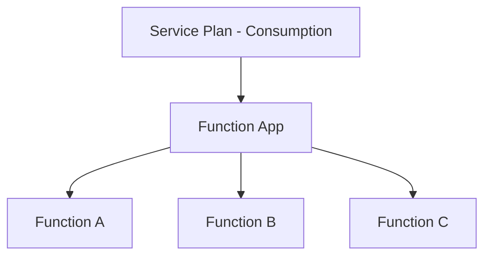

# Project Iteration 1: Function App Creation and Basic Triggers 

### Syllabus objectives covered:
- Create and configure an Azure Function app
- Implement function triggers by using data operations, timers, and webhooks

### Learning goals:

Master Function App creation, configuration, and implementation of core trigger types that respond to external events.

### Project Description:

Build a notification system that respond to different types of events. Create functions that trigger from HTTP requests, 
run on scheduled timers, and respond to webhook calls from external systems.

### Implementation steps:
1. Create a Function App with appropriate hosting plan selection
2. Implement an HTTP-triggered function for manual notifications
3. Create a timer-triggered function for daily summary reports
4. Add a webhook-triggered function for external system integration
5. Configure function-level security and access keys
6. Test each trigger type and understand their execution patterns


## Azure Function Hosting Plans

| **Plan type** | **How it works**                     | **When to use**                         | **Cost model**              |
|---------------|--------------------------------------|-----------------------------------------|-----------------------------|
| Consumption   | Scales to zero, pay per execution    | Sporadic workloads                      | Pay only when function run  |
| Premium       | Pre-warmed instances, no cold starts | Production apps needing < 1sec response | Pay for allocated capacity  |
| Dedicated     | Runs on App Service Plan             | Already have an App Service plan        | Same as App Service pricing |


## Comparison table for hosting plans

| **Feature**          | **Consumption**             | **Premium**              | **Dedicated**        |
|----------------------|-----------------------------|--------------------------|----------------------|
| **Cold starts**      | Yes (1-3sec)                | No (pre-warmed)          | No (always on)       |
| **Timeout**          | 10 min max                  | Unlimited                | Unlimited            |
| **Scaling**          | Auto (0-200)                | Auto(1-100)              | Manual / autoscale   |
| **VNet integration** | No                          | Yes                      | Yes                  |
| **Pricing model**    | Per execution               | Per instance + execution | Fixed monthly        |
| **Free tier**        | Yes (1M executions)         | No                       | No                   |
| **Best for**         | Events / sporadic workloads | Production APIs          | Existing App Service |


### Azure Functions flow
```
1. Client calls function URL
2. Azure routing receives request
3. Routing checks: Is there a warm instance available? 
    |
    |- NO ->  Provision Function App instance (cold start) 
    |         Load all functions in app
    |         Execute requested function
    |         Keep instance warm
    |
    |- YES -> Route to existing instance
              Execute requested function
              Keep instance warm
              
4. Instance stay alive for ~20 minute reuse
5. After idle period, instance deallocates (scale to zero)
6. Routing layer continues listening 
```

### Azure function architecture 
