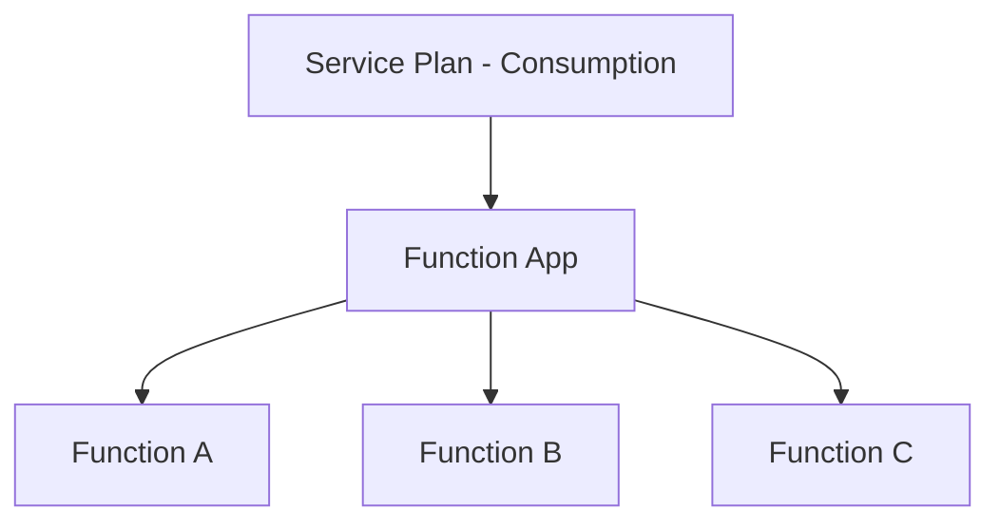
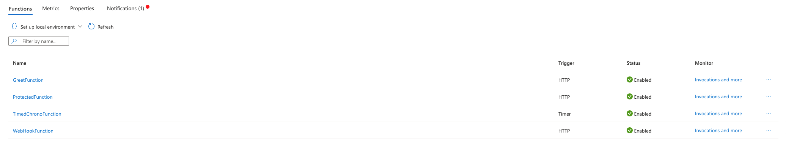
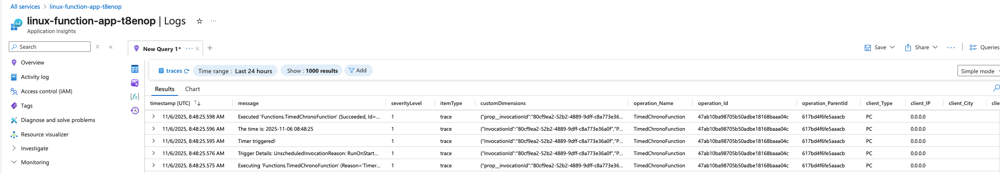

# Project Iteration 1: Function App Creation and Basic Triggers

### Syllabus objectives covered:

- Create and configure an Azure Function app
- Implement function triggers by using data operations, timers, and webhooks

### Learning goals:

Master Function App creation, configuration, and implementation of core trigger types that respond to external events.

### Project Description:

Build a notification system that respond to different types of events. Create functions that trigger from HTTP requests,
run on scheduled timers, and respond to webhook calls from external systems.

### Implementation steps:

1. Create a Function App with appropriate hosting plan selection
2. Implement an HTTP-triggered function for manual notifications
3. Create a timer-triggered function for daily summary reports
4. Add a webhook-triggered function for external system integration
5. Configure function-level security and access keys
6. Test each trigger type and understand their execution patterns

## Azure Function Hosting Plans

| **Plan type** | **How it works**                     | **When to use**                         | **Cost model**              |
|---------------|--------------------------------------|-----------------------------------------|-----------------------------|
| Consumption   | Scales to zero, pay per execution    | Sporadic workloads                      | Pay only when function run  |
| Premium       | Pre-warmed instances, no cold starts | Production apps needing < 1sec response | Pay for allocated capacity  |
| Dedicated     | Runs on App Service Plan             | Already have an App Service plan        | Same as App Service pricing |

## Comparison table for hosting plans

| **Feature**          | **Consumption**             | **Premium**              | **Dedicated**        |
|----------------------|-----------------------------|--------------------------|----------------------|
| **Cold starts**      | Yes (1-3sec)                | No (pre-warmed)          | No (always on)       |
| **Timeout**          | 10 min max                  | Unlimited                | Unlimited            |
| **Scaling**          | Auto (0-200)                | Auto(1-100)              | Manual / autoscale   |
| **VNet integration** | No                          | Yes                      | Yes                  |
| **Pricing model**    | Per execution               | Per instance + execution | Fixed monthly        |
| **Free tier**        | Yes (1M executions)         | No                       | No                   |
| **Best for**         | Events / sporadic workloads | Production APIs          | Existing App Service |

### Azure Functions flow

```
1. Client calls function URL
2. Azure routing receives request
3. Routing checks: Is there a warm instance available? 
    |
    |- NO ->  Provision Function App instance (cold start) 
    |         Load all functions in app
    |         Execute requested function
    |         Keep instance warm
    |
    |- YES -> Route to existing instance
              Execute requested function
              Keep instance warm
              
4. Instance stay alive for ~20 minute reuse
5. After idle period, instance deallocates (scale to zero)
6. Routing layer continues listening 
```

### Azure function architecture



## Implementation: Create and Deploy Functions

**Implementation steps covered:** 1, 2, 3, 4, and 6

- Run the provided `up.sh` script. It will:
    - Provision necessary resources through Terraform
    - Zip and upload the python Azure Functions bundle using the Azure CLI

After deployment, all four functions should be visible in the Azure Portal under your Function App:



You can now use `curl` or browser to trigger the newly created Azure Function!  
You will also be able to observe the timer triggered azure function running every 5 minutes in the metrics log and
follow live logging by entering the `log` tab
within each function:

```
-- HTTP TRIGGERED
2025-11-06T08:46:21Z   [Information]   Executing 'Functions.GreetFunction' (Reason='This function was programmatically called via the host APIs.', Id=32f272f4-4f42-4c8b-8ee2-435ea1e688ac)
2025-11-06T08:46:21Z   [Verbose]   Sending invocation id: '32f272f4-4f42-4c8b-8ee2-435ea1e688ac
2025-11-06T08:46:21Z   [Verbose]   Posting invocation id:32f272f4-4f42-4c8b-8ee2-435ea1e688ac on workerId:b9a9b81b-1873-4926-b48c-6b358889cfc9
2025-11-06T08:46:21Z   [Information]   GreetFunction triggered
2025-11-06T08:46:21Z   [Information]   Executed 'Functions.GreetFunction' (Succeeded, Id=32f272f4-4f42-4c8b-8ee2-435ea1e688ac, Duration=13ms)

-- TIMER TRIGGERED
2025-11-06T09:15:00Z   [Information]   Executing 'Functions.TimedChronoFunction' (Reason='Timer fired at 2025-11-06T09:15:00.0008233+00:00', Id=4c0931a7-3a02-41d5-9c67-60eacf86eadb)
2025-11-06T09:15:00Z   [Information]   Trigger Details: ScheduleStatus: {"Last":"2025-11-06T09:10:00.0007726+00:00","Next":"2025-11-06T09:15:00+00:00","LastUpdated":"2025-11-06T09:10:00.0007726+00:00"}
2025-11-06T09:15:00Z   [Verbose]   Sending invocation id: '4c0931a7-3a02-41d5-9c67-60eacf86eadb
2025-11-06T09:15:00Z   [Verbose]   Posting invocation id:4c0931a7-3a02-41d5-9c67-60eacf86eadb on workerId:a59529f9-1615-4cc7-9492-a3490ae859ed
2025-11-06T09:15:00Z   [Information]   Timer triggered!
2025-11-06T09:15:00Z   [Information]   The time is: 2025-11-06 09:15:00
2025-11-06T09:15:00Z   [Information]   Executed 'Functions.TimedChronoFunction' (Succeeded, Id=4c0931a7-3a02-41d5-9c67-60eacf86eadb, Duration=15ms)
```

Logs are also available through Application Insights, scrutinize at your own leisure.



In order to test the `Webhook` simply `curl` with the appropriate request body:

```bash
 curl -X POST ${function_app_url}/api/webhook/invoke \
  -H "Content-Type: application/json" \
  -d '{"spell": "Deafening Blast"}' 
```

❗It is worth noting that the HTTP trigger Functions are not dependent on a storage account, however:

**Timer triggers use Storage to:**

1. **Schedule Monitoring** - Store execution history in a blob called "schedule monitor"
2. **Singleton Lock** - Ensure only ONE instance executes the timer
3. **Past Due Detection** - Know if execution was missed

### General note on Storage and Triggers

**Triggers that need storage:**

- **Timer triggers** - State tracking
- **Queue triggers** - Read from Storage Queues
- **Blob triggers** - Monitor blob changes
- **Durable Functions** - Orchestration state

**Triggers that don't need Storage:**

- **HTTP triggers** - Stateless
- **Service Bus triggers** - Uses Service Bus, not Storage
- **Event Grid triggers** - Uses Event Grid
- **Cosmos DB triggers** - Uses Cosmos DB change feed

### WebHook-triggered Functions

Webhook-triggered functions **are** Http-triggered functions, however their pattern and use-cases are different.
Webhooks follow an `Event Notification pattern`, which characteristics are:

- Processing is Asynchronous - Event source does not wait for processing to complete
- Push model - External systems notifies the function when an event occurs
- Fire-and-forget - Caller does not care about response content, only that the request was received `200 - OK`
- Event-driven

Webhooks are widely used for events where the response only needs to be an acknowledgement of received request.

## Azure Function Access Keys

**Access keys** are shared secrets that control who can invoke functions. There are three levels of authorization:

### Anonymous (No Key Required (just the right height))

```python
@app.route(route="health", auth_level=func.AuthLevel.ANONYMOUS)
```

Means that anyone can call the function, URL alone is enough. Useful for:

- Public endpoints (health checks and public APIs).
- Webhooks from external systems that does not support keys.
- Development / Testing

### Function (Function-Specific key) Most common!

```python
@app.route(route="greet", auth_level=func.AuthLevel.FUNCTION)
```

Caller must provide a valid function key. Each function has their own unique key, but a "default" key for all functions
is also supported. When to use:

- Most scenarios (default choice)
- When different clients need access to different functions
- Standard API protection

Example:

```
curl https://your-app.net/api/webhook/invoke \
  -H "x-functions-key: ABC123XYZ..."
```

### Admin (Master Key Required)

```python
@app.route(route="admin/ban-feeder", auth_level=func.AuthLevel.ADMIN)
```

Caller must provide the "master key" (admin-level access). This is the highest security level, and there is only one
master key per **FUNCTION APP**❗. When to use:

- Administrative functions (rarely used for individual functions)
- Functions that manage other functions
- Very sensitive operations
- Rarely used in practice...

You can easily obtain your function keys via the Azure CLI:

```bash
 az functionapp keys list \
    --name <az-function-name> \
    --resource-group <rg> 

# Which should ouput: 
{
  "functionKeys": {
    "default": "function-key=="
  },
  "masterKey": "master-ke==",
  "systemKeys": {}
}
```

For functions that require either function keys or master keys, simply provide them in the request header!✨
Take a look at the CLI reference file for more useful Key management options such as creating custom keys,
deleting keys or even regenerate default keys!

## 5. Configure function-level security and access keys

For this implementation step we will use the azure CLI and the `ProtectedFunction`.

1. If we try to curl the function without a key we will not get a response at all. This is because the gateway BLOCKS
   the request, it will never reach the function.

```bash
# Curl without key
curl -X POST https://your-app.azurewebsites.net/api/protected \
  -H "Content-type: application/json" \
  -d '{
        "user": "FinalFragmest",
        "action": "Time-Out"
      }'
      
```

2. Now, lets try to get the correct function key and pass it as a header. Simply use the following Azure CLI command:

```bash
az functionapp function keys list \
  --name linux-function-app-h4u6wo \
  --resource-group azure-functions-resource-group \
  --function-name ProtectedFunction

# Should return: 
{
  "default": "key==",
  "id": null,
  "kind": null,
  "name": null,
  "properties": null,
  "type": null
}
```

Grab the key and add it to the Curl:

```bash
curl -X POST https://your-app.azurewebsites.net/api/protected \
  -H "Content-type: application/json" \
  -H "x-functions-key: $default_key"
  -d '{
        "user": "FinalFragment",
        "action": "Time-Out"
      }'
# This should now return a whole HTTP json dump, and at the very bottom: 
{
  "status": "success",
  "message": "Action Time-Out performed on user: FinalFragment",
  "timestamp": "2025-11-06T20:13:00.630953",
  "authenticated": true
} 
```

Feel free to create new custom keys, delete keys and generate new default keys. All relevant commands are provided in
the `CLI-COMMANDS.md` reference file.✨

## ⚠️ Security Best Practices ⚠️

1. Use `FUNCTION` level by default
2. Store keys in environment variables
3. Rotate keys periodically; regenerate every 90 days, or when team members leave.
4. Use different keys for different clients. Create custom keys per client/application, it is very easy to revoke keys!
5. Never commit keys to Git (julegr0t)
6. Use headers over query strings

```bash
# Best (key not in URL)
curl https://app.net/api/data -H "x-functions-key: KEY"

# Bad (key visible in logs)
curl "https://app.net/api/data?code=KEY"
```

## Key Learning Questions:

### How do you choose between Consumption, Premium, and Dedicated hosting plans?

See Azure Function Hosting Plans section table!

--- 

### What's the difference between function-level and admin-level access keys?

Function level keys are unique per function. The Admin level access keys are unique per Function App.

---

### How do timer expressions work, and how can you test them without waiting for scheduled execution?

**Timer expressions uses CRON syntax with 6 fields:**

```
{second} {minute} {hour} {day} {month} {day-of-week}  

Examples: 
 0 */5 * * * * - Every 5 minutes
 0 0 9 * * * - Every day at 09:00
 0 30 8 * * 1-5 - 08:30 on weekdays (Mon-Fri)
```

**Testing without waiting:**

- Set `run_on_startup=True` in the decorator, the function runs immediately when deployed
- Use a very short interval for testing (every 1-2 minutes)
- Manually trigger via Azure Portal

---
