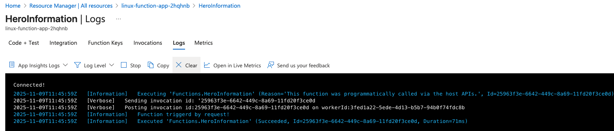
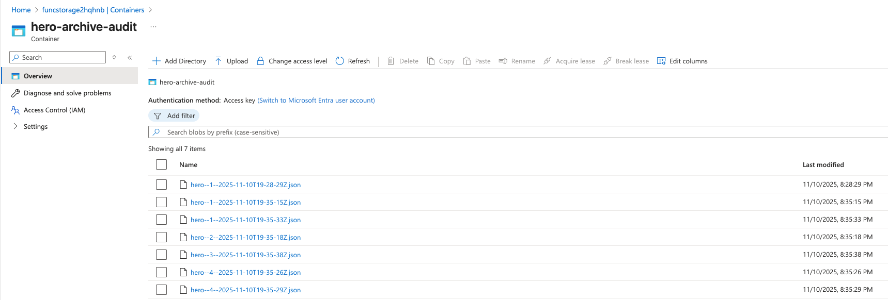
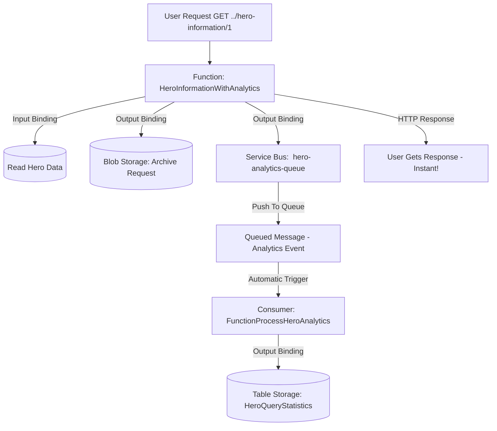
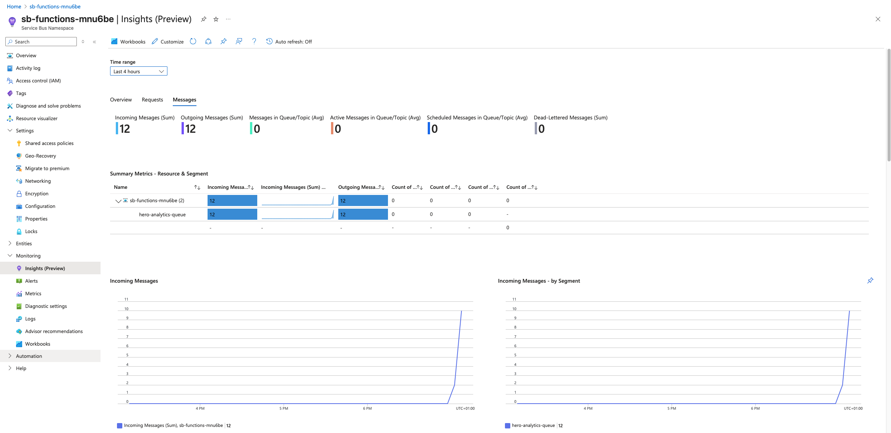

# Project Iteration 2: Data Integration With Bindings 

### Syllabus objectives covered: 

- Implement input and output bindings

### Learning goals:

Master Azure Functions bindings to seamlessly integrate with Azure services without writing complex integration code.

### Project Description:
Enhance your notification system to read data from various Azure services and write results to different destinations. 
Implement input bindings that automatically provide data to your functions and output bindings that store results.

### Implementation steps:

1. Add Cosmos DB input binding to read hero information
2. Implement Blob Storage output binding to archive notifications
3. Create Service Bus output binding for reliable message delivery
4. Add Table Storage binding for tracking notification history
5. Configure binding connection strings and authentication
6. Test data flow through multiple bindings in a single function (Testing is done throughout implementation)

## Note on Bindings:

Bindings are Azure's declarative way to connect functions to Azure resources. In Python v2, bindings are implemented as decorators, as we will soon see.
They let us specify WHAT we want, instead of HOW we want it. Bindings eliminate boilerplate code for connections, authentication, serialization and error handling. 

#### Key characteristics
- **Declarative** - Specify WHAT we want, not HOW
- **Two types** - Input bindings (read data) and Output bindings (write data) 
- **Automatic plumbing** - Azure handles connections, authentication, retries etc...
- **Reduces boilerplate** - Eliminates many lines of SDK/connection code per integration
- **Built-in support** - Ready-to-use integration for Cosmos DB, Storage, Service Bus, Event Grid etc...

```python
# Example 
@app.cosmos_db_input(database_name="user-db", container_name="Users", ...)
def my_function(req, user):  # 'user' automatically loaded from Cosmos DB
    # No connection code needed!
    return func.HttpResponse(f"Hello {user['name']}")
```

### Quick note on partition keys:
This demonstration is not centered around CosmosDB, but it is worth mentioning that a **Partition Key** is a field CosmosDB uses to distribute
data across physical partitions for scale.
```json
{
  "userId": "user123",  <- this is the partition key
  "name": "Jesse",
  "email": "jesse@example.com"
}
```
All documents with the same `userId` are stored together (co-located).

### Table comparison cosmos DB vs relation database:
| Concept           | Description                                      | Analogy                       |
|-------------------|--------------------------------------------------|-------------------------------|
| **Account**       | The overall Cosmos DB resource in Azure          | Like a database server        |
| **Database**      | A logical grouping of containers                 | Like a database in SQL Server |
| **Container**     | Where JSON documents live (scales independently) | Like a table, but schema-less |
| **Item**          | A single JSON document                           | Like a row, but flexible      |
| **Partition key** | Used to group & scale items                      | Like a sharding key           |


## 1. Add Cosmos DB input binding to read hero information:

### Implementation: Cosmos DB Input Binding: 

For implementation details take a look at the sample code in `/functions/function_app.py` file.
```python
# Bindings explanation
@app.cosmos_db_input(
    arg_name="hero_information",             # Parameter name in function signature ( can be named anything )
    database_name="herodb",                  # Cosmos DB database name
    container_name="hero-information",       # Container where documents live
    connection="CosmosDbConnectionString",   # App setting name with connection string
    id="{heroId}",                           # Document ID from route parameter
    partition_key="{heroId}",                # Partition key value (same as ID in this case)
)
```
**Key concepts:**
- **Binding expressions** - `{heroId}` pulls from route parameter automatically
- **arg_name** - The `hero_information` parameter is injected by Azure, so no manual loading needed
- **connection** - References the app setting configured in Terraform: `"CosmosDBConnectionString" `

### How to set up and test Input Bindings: 
1. run `./up.sh` (Provisions infrastructure and terraform outputs)
2. run `./populate_database.sh` 
   - Installs the `Azure Cosmos` client library for Python
   - Retrieves Cosmos DB connection details from Terraform output 
   - Invokes the Python script: `./populate_database.py` which: 
   - Connects to the Cosmos DB and populates it with testdata. 
3. Verify data in portal: Azure Portal &rarr; Cosmos DB &rarr; Data Explorer &rarr; herodb &rarr; hero-information &rarr; Items
4. Run curls against the azure function!
```bash
curl https://linux-function-app-2hqhnb.azurewebsites.net/api/hero-information/1

# Should return: 
{
    "id": "1",
    "heroId": "1",
    "name": "Invoker",
    "attackType": "Ranged",
    "primaryAttribute": "Intelligence",
    "roles": [
        "Mid",
        "Nuker",
        "Disabler"
    ],
    "difficulty": "Hard",
    "_rid": "+agwAMqK-KkBAAAAAAAAAA==",
    "_self": "dbs/+agwAA==/colls/+agwAMqK-Kk=/docs/+agwAMqK-KkBAAAAAAAAAA==/",
    "_etag": "\"0000bf00-0000-0c00-0000-690fae880000\"",
    "_attachments": "attachments/",
    "_ts": 1762635400
}
```
You should also se the function log the request: 



## 2. Implement Blob Storage output binding to archive notifications

Output bindings save data when a function completes, it basically saves the result automatically.  
For this demonstration we will add an output biding to our existing `hero-information` function, however, we will create a new function just to keep them separated.
Similarly to the Input Binding, it is very easy to configure the decorator: 
```python
@app.blob_output(
    arg_name="archive",                                       # Parameter name in function
    path="hero-archive-audit/hero-{heroId}-{datetime}.json",  # Dynamic blob path
    connection="AzureWebJobsStorage"                          # Storage connection string to Azuere Storage Account
)
   
def get_hero_information_with_audit(
        req: func.HttpRequest,
        document_list: func.DocumentList,
        archive: func.Out[str]                                # Output binding parameter from Decorator
) -> func.HttpResponse:
```
⚠️ **Important:** The Blob path prefix must match your container name:

**Container name in Terraform:**
```hcl
name = "hero-archive-audit"
```

**Path prefix in binding:**
```python
path = "hero-archive-audit/hero-{heroId}-{datetime}.json"
                &uarr; Must match container name ❗
```

If they don't match, you'll get a 404 error when trying to save blobs.

### How to test: 
After running the `./up.sh` script, do some curl requests against the new function endpoint!  
We will get the same response as for the function with only Input Binding, but every audit is also archived to the Storage Blob we provisioned. 

**Verify Archive in Azure Portal:**
1. Navigate to Storage Account → **Containers**
2. Open **hero-archive-audit** container
3. See your archived JSON files with timestamps



### Use cases: 
This **write-and-forget** pattern is useful for scenarios like: 
- Archiving/audit logs (what we built)
- Storing files/images
- Data lake/analytics
- Backups

## 3 + 4: Service Bus Queue Output + Table Storage Output

In the previous iteration we created an output-binding to archive / audit. In that scenario we needed **persistence** and **direct write** to storage.  
In this scenario we will pass messages through our function and into another consuming component. 

### Characteristics: 
- Asynchronous processing - Decoupled sender from receiver 
- Guaranteed delivery - Messages will not be lost
- Built-in retry logic - Auto-retry on failure 
- Dead letter queue - Failed messages go to special queue
- Message lifetime - Can expire after defined time
- FIFO ordering  - Messages are processed in order (First-In-First-Out)


This pattern is very useful for scenarios like: 
- Background job processing 
- Workflow orchestration
- Decoupling of microservices
- Reliable command/event delivery


### Implementation: 
For these particular implementation steps we need the following infrastructure: 
- **Azure Service Bus Namespace** : Provisioned through Terraform.
- **Azure Service Bus Queue** : Provisioned through Terraform.
- **Table storage** : Provisioned through Terraform (part of the Storage Account).

And bindings for: 
- **Cosmos DB Input** : Similar to previous iterations.
- **Blob Storage Output**: Similar to previous iteration with archiving to Blob.
- **Service Bus Queue Output**: For passing messages to Queue from exposed HTTP function.
- **Service Bus Queue Trigger**: For consumer function to trigger on new Messages to Queue.
- **Table Output**: For consumer function to write analytics to Table Storage.


### Service Bus Bindings: 
```python
# Function to push messages can use this binding:
@app.service_bus_queue_output(
    arg_name="analytics_queue",             # Function variable, can be named anything 
    queue_name="hero-analytics-queue",      # Queue name, must match with resource from azurerm_servicebus_queue 
    connection="ServiceBusConnection",      # Connection / authentication method
)
def get_hero_with_analytics(
    req: func.HttpRequest,
    document_list: func.DocumentList,
    archive: func.Out[str],
    analytics_queue: func.Out[str],
) -> func.HttpResponse:
   
# Function to consume messages from queue can use this binding:
@app.service_bus_queue_trigger(
    arg_name="msg",                          # Function variable, can be named anything
    queue_name="hero-analytics-queue",       # Queue name, must math with resource from azurerm_servicebus_queue
    connection="ServiceBusConnection"        # Connection / authentication method 
)
def process_analytics(
    msg: func.ServiceBusMessage,
    hero_stats: func.Out[str],
):
```


### Architecture
Once we have glued everything together, the architecture / request flow will look something like this: 




### How to test
Start by provisioning infrastructure with the `up.sh` script as before.  
Once it has completed, you can, as before populate the CosmosDB with some test data by running the `populate_database.sh` script. 
Lastly, run the `hero_information_request.sh` script, it will perform multiple HTTP requests to the newly created Azure Function: `HeroInformationWithAnalytics`.

I would suggest that you inspect logs from for example the consuming function `ProcessHeroAnalytics` from:  
Azure Portal &rarr; Function App &rarr; ProcessHeroAnalytics &rarr; Logs Tab  
You should observe the Messages on Queue being consumed and handled correctly:

```bash
2025-11-16T18:03:57Z   [Information]   Executing 'Functions.ProcessHeroAnalytics' (Reason='(null)', Id=26a26a9a-1c90-4b08-85b5-ecbbf88f4ba2)
2025-11-16T18:03:57Z   [Information]   Trigger Details: MessageId: 796ff79c0e2742568c47095abd3fa7a6, SequenceNumber: 6, DeliveryCount: 1, EnqueuedTimeUtc: 2025-11-16T18:03:56.6630000+00:00, LockedUntilUtc: 2025-11-16T18:04:56.6780000+00:00, SessionId: (null)
2025-11-16T18:03:57Z   [Verbose]   Sending invocation id: '26a26a9a-1c90-4b08-85b5-ecbbf88f4ba2
2025-11-16T18:03:57Z   [Verbose]   Posting invocation id:26a26a9a-1c90-4b08-85b5-ecbbf88f4ba2 on workerId:948d8091-3991-4722-9ea8-6e058159a924
2025-11-16T18:03:57Z   [Information]   Processing : hero_queried for Queen of Pain
2025-11-16T18:03:57Z   [Information]   Statistics updated for hero: Queen of Pain
2025-11-16T18:03:57Z   [Information]   Request [5869e984-5cd1-4961-80e7-7d0ff138d5d5] POST https://funcstoragemnu6be.table.core.windows.net/$batch

x-ms-version:REDACTED
DataServiceVersion:REDACTED
Accept:application/json
Content-Type:multipart/mixed; boundary=batch_559a840d-6109-46a0-866a-45c307465e71
x-ms-client-request-id:5869e984-5cd1-4961-80e7-7d0ff138d5d5
x-ms-return-client-request-id:true
User-Agent:azsdk-net-Data.Tables/12.11.0 (.NET 8.0.12; Debian GNU/Linux 11 (bullseye))
x-ms-date:REDACTED
Authorization:REDACTED
client assembly: Azure.Data.Tables
2025-11-16T18:03:57Z   [Information]   Response [5869e984-5cd1-4961-80e7-7d0ff138d5d5] 202 Accepted (00.1s)

```

It is also possible to see the Table storage content through the Azure CLI:   
### CLI example to see table storage:  
```bash

az storage entity query \
  --table-name HeroQueryStatistics \
  --account-name funcstoragemnu6be \
  --query "sort_by(items, &Timestamp)[].{Hero:HeroName, HeroId:HeroId, Time:Timestamp}" \
  --output table \
  
# Will output:

Hero            HeroId    Time
--------------  --------  --------------------------------
Queen of Pain   5         2025-11-16T17:59:02.738753+00:00
Dragon Knight   6         2025-11-16T17:59:06.816880+00:00
Invoker         1         2025-11-16T18:03:54.722978+00:00
Juggernaut      2         2025-11-16T18:03:55.222184+00:00
Axe             3         2025-11-16T18:03:55.882862+00:00
Queen of Pain   5         2025-11-16T18:03:56.687362+00:00
Dragon Knight   6         2025-11-16T18:03:57.147757+00:00
Queen of Pain   5         2025-11-16T18:03:57.455944+00:00
Queen of Pain   5         2025-11-16T18:03:57.814418+00:00
Dragon Knight   6         2025-11-16T18:03:58.406249+00:00
Leshrac         7         2025-11-16T18:03:58.747262+00:00
Crystal Maiden  4         2025-11-16T18:03:59.073895+00:00
```
We can also observe quite clearly how the requests are being registered in the `Insights` tab for our Service Bus:  




## 5. Configure binding connection strings and authentication:
All bindings authenticate using connection strings configured in Terraform app settings.

**Connection Strings Configured**: 
- `CosmosDbConnectionString` - Authenticates Cosmos DB access
- `AzureWebJobsStorage` - Authenticates Storage Account (Blob + Table)
- `ServiceBusConnection` - Authenticates Service Bus access

**How bindings use authentication:**
```python
@app.cosmos_db_input(
    connection="CosmosDbConnectionString"  # References app setting
)
```
The `connection` parameter tells the binding which app setting contains the connection string. Azure handles authentication automatically using these credentials.

#### ⚠️ Security Note ⚠️
Connection strings contain secrets and should never be committed to GitHub. They are configured via Terraform and stored securely in Azure.

#### Alternative Authentication:
Managed Identity can be used instead of connection strings for enhanced security (not covered in this project, but stay tuned for projects covering it in the future).


## Key Learning Questions:

### How do bindings differ from manually using Azure SDKs in function code? 

**Bindings are declarative** - we specify WHAT data we need in the decorator, and Azure handles all connection logic automatically.

**Manual SDKs require:**
- Creating client objects (CosmosClient, BlobServiceClient)
- Managing connection strings and authentication
- Writing serialization / deserialization code
- Implementing retry logic
- Handle connection lifecycles

**Bindings provide:**
- Automatic connection management
- Built-in authentication
- Declarative configuration
- Zero boilerplate code 🌟

**Example:**
- **With SDK:** 50+ lines of connection, auth, and error handling
- **With binding:** 1 decorator + 1 line to use the data

---

### What happens when an output binding fails while your function logic succeeds? 

The function **fails and retries**, but not in a **transactional** way:

1. Function logic executes successfully
2. Output binding executes sequentially  
3. If binding fails, (for example storage unavailable):
   - Function is marked as failed
   - Already completed bindings are not rolled back ⚠️
   - For retriable triggers (Service Bus/Queue): Message returns to queue for retry
   - For HTTP triggers -> returns 500 error

**On retry:**
- Entire function runs again
- ALL bindings execute again (including ones that already succeeded)

```python
@app.blob_output(...)
@app.service_bus_output(...)
def function(req, blob, queue):
    blob.set(data)     # Executes and SUCCEEDS
    queue.set(msg)     # FAILS 
    
# Function fails, trigger retries
# On retry:
#   - blob.set() executes AGAIN (duplicate blob or overwrite)
#   - queue.set() hopefully succeeds this time
```

---

### How can you use multiple output bindings to write to different services atomically?
You can't - Azure Functions bindings are NOT transactional.

**What happens:**
- Bindings execute sequentially in decorator order
- Each binding completes independently
- No rollback if later bindings fail
- No coordination between services

So, be careful!