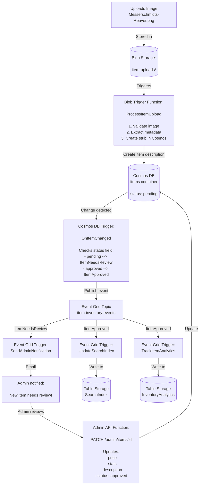
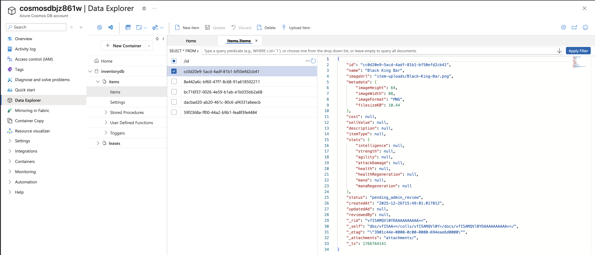

# Project Iteration 3: Event-Driven Data Processing 


### TODO 
- Document Event Grid Topics better, should be a small section
- 


### Service Bus vs Event Grid 
Complementary not replacements,  

**Service Bus purpose**: Reliable messaging for commands and items to work on.

**Service Bus Used for**: Background jobs (process this order), Work queues ("resize these 100 images"), Pont-to-point communication, when **guarantied processing** is needed.

architecture: 
```
Producer → Queue → Consumer
         ↑ Guaranteed delivery
         ↑ Ordered processing
         ↑ Retry logic
```


EG purpose: Broadcast **events** and **notifications**
EG-used for: "Something happened" notification, system-wide events ( blob created, VM started), Multiple reactions to same event, when you need **broadcasting**.

architecture: 
```
Publisher → Event Grid → Subscriber 1
                      → Subscriber 2
                      → Subscriber 3
         ↑ Pub/Sub pattern
         ↑ Multiple listeners
         ↑ Fast, lightweight
```

How they could work together: 
**Common pattern** 
- Event grid: "new order created" (broadcast notification)
- Service bus: "process order 123" ( work the item with retry ) // todo what is the item here

### Semi-BIS Terraform file structure: 
## File Structure Summary
```
terraform/
├── main.tf                       # Provider, resource group, random suffix
├── variables.tf                  # All input variables
├── storage.tf                    # Storage account, containers, tables
├── cosmosdb.tf                   # Cosmos DB, databases, containers
├── eventgrid.tf                  # Event Grid topic
├── eventgrid-subscriptions.tf    # Event Grid subscriptions (separate for clarity)
├── functions.tf                  # App Insights, Service Plan, Function App
└── outputs.tf                    # All outputs 
```

### storage.tf 
Used for image uploads and holding images

### cosmosdb.tf
Used for holding documents created by function and followup by administrator

### Overall project: 
1. upload item image
2. Blob trigger function ( automatically ) 
   1. Resize image (thumbnail + full image )
   2. Extract medata from filename
   3. Save to cosmos DB ( item listing)
   4. Save resized image back to blob
3. Cosmos DB change Feed Trigger (automatic)
   1. Publish to evnt grid "item-created" event
   2. Update search index 
   3. Send notification queue 
4. Event Grid trigger function (automatic)
   1. Send mail to admin: "item x needs stats!"

Everything will be automatic, the "user" just uploads an image and everything else happens

// TODO make this better, but it is overall the correct architecture

note: we are not sending email in this example, but you get the gist of it.
### 
Subscriptions: 
- Consumer Function for Item in need for review.
- Consumer Update search index? 
- Consumer Update Inventory Analytics.


## Event Grid Subscriptions:
An Event Grid implements the Pub/Sub architecture.
### Component breakdown: 
**1. Event Grid Topic (Message Bus):**  
A centralized endpoint that receives and routes events.  
Terraform configuration example: 
```hcl
# terraform/eventgrid.tf
resource "azurerm_eventgrid_topic" "inventory_events" {
  name                = "event-name"
  resource_group_name = azurerm_resource_group.functions-group.name
  location            = "northeurope"
  
  input_schema = "CloudEventSchemaV1_0"  # Accepts CloudEvents format
}
```
The EventGrid resource provides us with a Endpoint url (on which to push events) and an Access Key for authentication.  
Both of these are configured in the `app_settings` of our Azure Linux Function App resource:  
```hcl
# Event Grid Configuration
"EventGridTopicEndpoint" = azurerm_eventgrid_topic.item_inventory_events.endpoint
"EventGridTopicKey"      = azurerm_eventgrid_topic.item_inventory_events.primary_access_key
```

**2. Publisher (Event producer):**  
Azure Function that sends events TO the Event Grid Topic.  
Publisher Function example:
```python
import azure.functions as func
import json
app = func.FunctionApp()

@app.function_name(name="OnItemChanged")
@app.cosmos_db_trigger(...)
@app.event_grid_output(
    arg_name="event_grid_event",
    topic_endpoint_uri="EventGridTopicEndpoint",  #  Points to Topic URI
    topic_key_setting="EventGridTopicKey"         #  Access key for auth
)
def on_item_changed(documents, event_grid_event):
    # Create CloudEvent
    event = {
        "specversion": "1.0",
        "type": "Inventory.ItemNeedsReview",      # Event type (important for routing!)
        "source": "inventory-system/cosmos-db",
        "data": { ... }
    }
    
    # Publish to Event Grid Topic
    event_grid_event.set(json.dumps([event]))
```
**What happens:**

1. Function creates event of type Inventory.ItemNeedsReview
2. Azure Functions runtime sends HTTP POST to Event Grid Topic endpoint
3. Event Grid Topic receives and stores the event
4. Event Grid begins routing process

**3. Event Grid Subscription (Routing Rule):**
A configuration that tells Event Grid that, "when event X happens, route to endpoint Y".  
Terraform configuration example:
```hcl
# terraform/eventgrid-subscriptions.tf
resource "azurerm_eventgrid_event_subscription" "item_needs_review" {
  name  = "item-needs-review-notification"
  scope = azurerm_eventgrid_topic.inventory_events.id   #  Which Topic to monitor
  included_event_types = ["Inventory.ItemNeedsReview"]  # Only route these event types
  event_delivery_schema = "CloudEventSchemaV1_0"        # Adhere to EventGrid event type
  
  # Destination: Where to send matching events
  webhook_endpoint {
    url = "https://my-function-app.azurewebsites.net/runtime/webhooks/eventgrid?functionName=SendAdminNotification"
  }
}
```
This configures:
- **Source:** Event Grid Topic `inventory-events`
- **Filter:** Only events of type `Inventory.ItemNeedsReview`
- **Destination:** Webhook to notification through url webhook

**4. Subscriber (Event Consumer):**
A function that receives events FROM Event Grid via webhook.  
Subscriber function example: 
```python
import azure.functions as func
import logging

app = func.FunctionApp()


@app.function_name(name="SendAdminNotification")
@app.event_grid_trigger(arg_name="event")  # ← Event Grid trigger, no explicit config needed!
def send_admin_notification(event: func.EventGridEvent):
    # Process the event
    logging.info(f"Received event: {event.event_type}")
    data = event.get_json().get('data', {})
    # ... handle notification
```
In this project, we filter on two different events, but for three subscribers:
- ItemNeedsReview event &rarr; Only goes to SendAdminNotification 
- ItemApproved event &rarr; Goes to UpdateSearchIndex + InventoryAnalytics


#### Update search index: 
Purpose: Make approved items searchable. Cosmos DB is great for storing data, but not optimized for text search. This is why we want a **search-optimized index**

#### Track item analysis: 
Purpose: Collect metrics about inventory for dashboards and reports. 
- How many items created this week / month

## implementation plan: 

1) Blob trigger - Image processing
   1) Blob trigger (automatic file processing )
   2) Multiple output bindings  (blob + cosmos DB)
   3) Real image processing (resize)
   4) Metadata extraction
2) Cosmos DB change feed trigger - react to new patterns (on item created)
   1) Cosmos DB change feed (react to database change)
   2) Event grid output binding (publish event)
   3) Event-driven architecture
3) Event Grid Trigger - Send admin notification
   1) Event Grid trigger (react to system events)  
   2) Multiple subscribers to same event 
   3) Loose coupling 
4) Update search index on the same event. 
5) Analytics tracking also? All these three could happen on the same event


Other stuff to do: 
- Error handling and Retry policies : Blob trigger  (poison blob after max number of retries `host.json`)
- Cosmos DB trigger (retries from last checkpoint) // TODO find out what this means
- Event grid: dead letter destination for failures, built-in retry with exponential backoff. ( configure in event grid subscription )  


### Interesting test scenarios:
1. Upload invalid file (not an image) &rarr;Trigger should fail, retry, then poison queue
2. Cosmos DB unavailable (simulate by wrong connection string) &rarr; Blob trigger retries, eventually fails
3. Event Grid endpoint down &rarr; Event Grid retries with backoff, then dead letters
4.Duplicate processing (idempotency test) &rarr;  Upload same file twice  + Ensure no duplicate items in Cosmos DB


### Extra infrastructure needed 
- event grid topic 
- event subscription 
- storage containers ( item uploads, item thumbnail, items, leases - for change feed??)
- 


### Leases container: 
This is a container that is needed for the change feed trigger to track which items has been processed.
Its purpose is to track which changes has been processed and which function instance that is processing which partition.

It works as a checkpoint if a function crashes half-way through processing.


### What we will build 

* This is a commit test


### Common fail scenarios and outcome: 
``` 
Message has reached MaxDequeueCount of 5. Moving message to queue 'webjobs-blobtrigger-poison'.
```

### Running the function locally: 
1. Create the terraform outputs that we need for our bindings: 
   - Connection string to the Blob storage for image uploads 
   - Connection string to the storage account where the function will write documents
2. Capture them in a script, they are sensitive so we can not see them directly from the Terraform output.
3. Add them to your `local.settings.json` configuration so that your locally running function can interact with both databases.

Result:   
``` 
For detailed output, run func with --verbose flag.
[2025-12-16T09:18:03.059Z] Host lock lease acquired by instance ID '0000000000000000000000008BBD12A2'.
[2025-12-16T09:18:29.652Z] Executing 'Functions.ProcessItemUpload' (Reason='New blob detected(LogsAndContainerScan): item-uploads/Glimmer-Cape.png', Id=569b1ccd-0767-4f46-a14a-e4838b7e48fa)
[2025-12-16T09:18:29.653Z] Trigger Details: MessageId: 9e22a625-86fe-491c-a600-a68de3eb0cd4, DequeueCount: 1, InsertedOn: 2025-12-16T09:18:29.000+00:00, BlobCreated: 2025-12-16T09:18:24.000+00:00, BlobLastModified: 2025-12-16T09:18:24.000+00:00
[2025-12-16T09:18:29.688Z] Received upload: <azure.functions.blob.InputStream object at 0x1073d94f0>
[2025-12-16T09:18:29.688Z] Processing upload: item-uploads/Glimmer-Cape.png.png
[2025-12-16T09:18:29.739Z] Item stub created: Glimmer Cape (ID: 16028cb8-f8e1-407b-a6ef-405d4a1ae02b)
[2025-12-16T09:18:29.739Z] Status: pending_admin_review
[2025-12-16T09:18:29.740Z] Image: item-uploads/Glimmer-Cape.png.png
[2025-12-16T09:18:30.644Z] Executed 'Functions.ProcessItemUpload' (Succeeded, Id=569b1ccd-0767-4f46-a14a-e4838b7e48fa, Duration=1178ms)
```

You should now be able to observe the document created in the Cosmos DB Data explorer



### Test script 
I have added a script for testing uploads: `./test_upload.sh`. This script will use the Azure CLI and upload an image to the Azure Blob Storage, and thus trigger the 
azure function to create a new item document, and upload it to the Cosmos DB. 


I highly suggest that iteratively add configurations to your `local.settings.json`. It is an excellent way of 
debugging and figuring out how everything ties together from your local machine, while using real provisioned Azure Resources.


### Read more about the Cloud events here:
https://learn.microsoft.com/en-us/azure/event-grid/cloud-event-schema