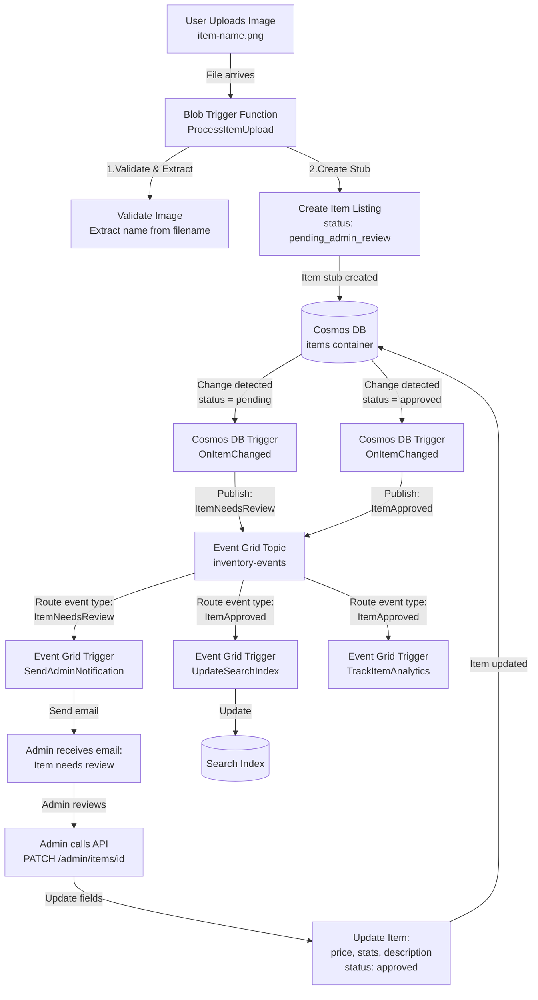

# Project Iteration 3: Event-Driven Data Processing 


### Service Bus vs Event Grid 
Complementary not replacements, 
SB purpose: Reliable messaging for commands and items to work on
SB-Used for: Background jobs (process this order), Work queues ("resize these 100 images"), Pont-to-point communication, when **guarantied processing** is needed.

architecture: 
```
Producer → Queue → Consumer
         ↑ Guaranteed delivery
         ↑ Ordered processing
         ↑ Retry logic
```


EG purpose: Broadcast **events** and **notifications**
EG-used for: "Something happened" notification, system-wide events ( blob created, VM started), Multiple reactions to same event, when you need **broadcasting**.

architecture: 
```
Publisher → Event Grid → Subscriber 1
                      → Subscriber 2
                      → Subscriber 3
         ↑ Pub/Sub pattern
         ↑ Multiple listeners
         ↑ Fast, lightweight
```

How they could work together: 
**Common pattern** 
- Event grid: "new order created" (broadcast notification)
- Service bus: "process order 123" ( work the item with retry ) // todo what is the item here

### Semi-BIS Terraform file structure: 
## File Structure Summary
```
terraform/
├── main.tf                       # Provider, resource group, random suffix
├── variables.tf                  # All input variables
├── storage.tf                    # Storage account, containers, tables
├── cosmosdb.tf                   # Cosmos DB, databases, containers
├── servicebus.tf                 # Service Bus namespace & queues
├── eventgrid.tf                  # Event Grid topic
├── eventgrid-subscriptions.tf    # Event Grid subscriptions (separate for clarity)
├── functions.tf                  # App Insights, Service Plan, Function App
└── outputs.tf                    # All outputs 
```


### Overall project: 
1. upload item image
2. Blob trigger function ( automatically ) 
   1. Resize image (thumbnail + full image )
   2. Extract medata from filename
   3. Save to cosmos DB ( item listing)
   4. Save resized image back to blob
3. Cosmos DB change Feed Trigger (automatic)
   1. Publish to evnt grid "item-created" event
   2. Update search index 
   3. Send notification queue 
4. Event Grid trigger function (automatic)
   1. Send mail to admin: "item x needs stats!"

Everything will be automatic, the "user" just uploads an image and everything else happens

// TODO make this better, but it is overall the correct architecture


#### Update search index: 
Purpose: Make approved items searchable. Cosmos DB is great for storing data, but not optimized for text search. This is why we want a **search-optimized index**

#### Track item analysis: 
Purpose: Collect metrics about inventory for dashboards and reports. 
- How many items created this week / month

## implementation plan: 

1) Blob trigger - Image processing
   1) Blob trigger (automatic file processing )
   2) Multiple output bindings  (blob + cosmos DB)
   3) Real image processing (resize)
   4) Metadata extraction
2) Cosmos DB change feed trigger - react to new patterns (on item created)
   1) Cosmos DB change feed (react to database change)
   2) Event grid output binding (publish event)
   3) Event-driven architecture
3) Event Grid Trigger - Send admin notification
   1) Event Grid trigger (react to system events)  
   2) Multiple subscribers to same event 
   3) Loose coupling 
4) Update search index on the same event. 
5) Analytics tracking also? All these three could happen on the same event


Other stuff to do: 
- Error handling and Retry policies : Blob trigger  (poison blob after max number of retries `host.json`)
- Cosmos DB trigger (retries from last checkpoint) // TODO find out what this means
- Event grid: dead letter destination for failures, built-in retry with exponential backoff. ( configure in event grid subscription )  


### Interesting test scenarios:
1. Upload invalid file (not an image) &rarr;Trigger should fail, retry, then poison queue
2. Cosmos DB unavailable (simulate by wrong connection string) &rarr; Blob trigger retries, eventually fails
3. Event Grid endpoint down &rarr; Event Grid retries with backoff, then dead letters
4.Duplicate processing (idempotency test) &rarr;  Upload same file twice  + Ensure no duplicate items in Cosmos DB


### Extra infrastructure needed 
- event grid topic 
- event subscription 
- storage containers ( item uploads, item thumbnail, items, leases - for change feed??)
- 


### Leases container: 
This is a container that is needed for the change feed trigger to track which items has been processed.
Its purpose is to track which changes has been processed and which function instance that is processing which partition.

It works as a checkpoint if a function crashes half-way through processing.


### What we will build 

* This is a commit test