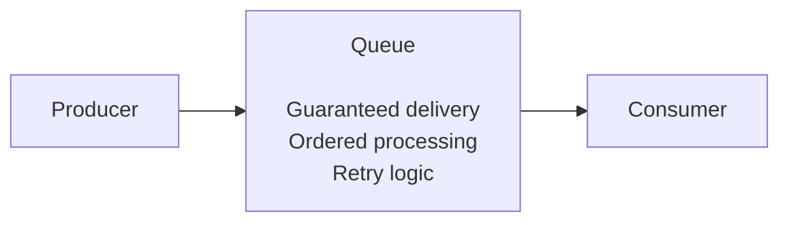
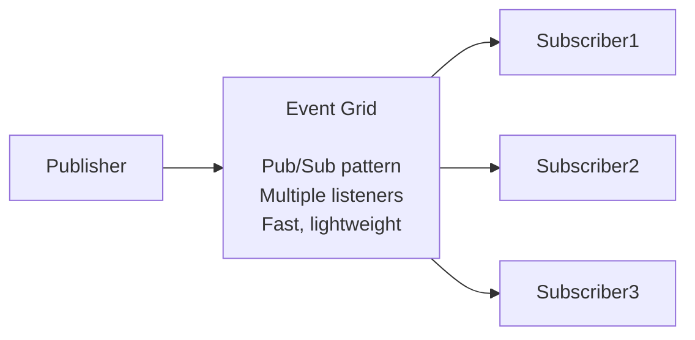
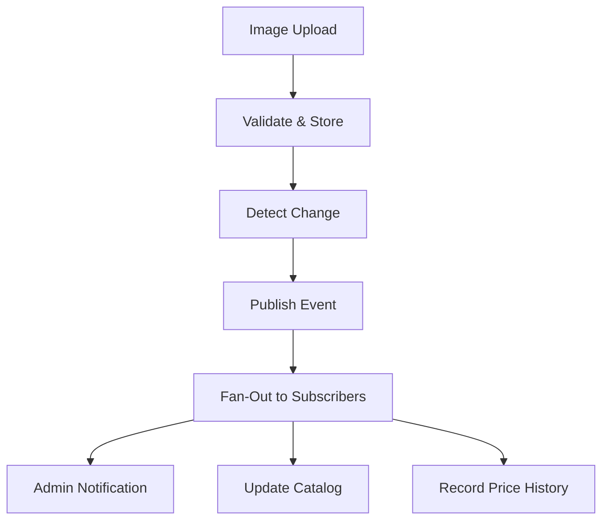
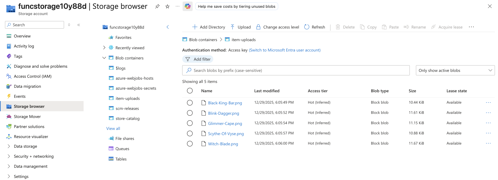
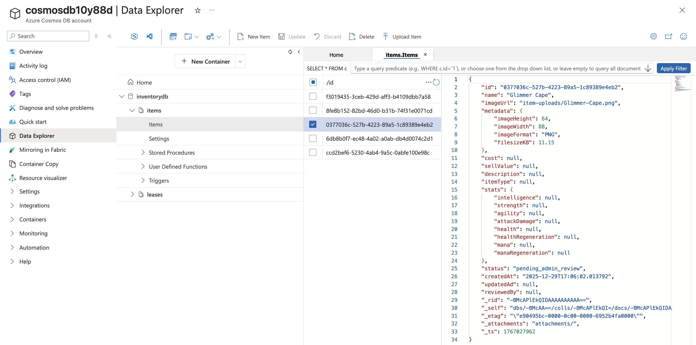
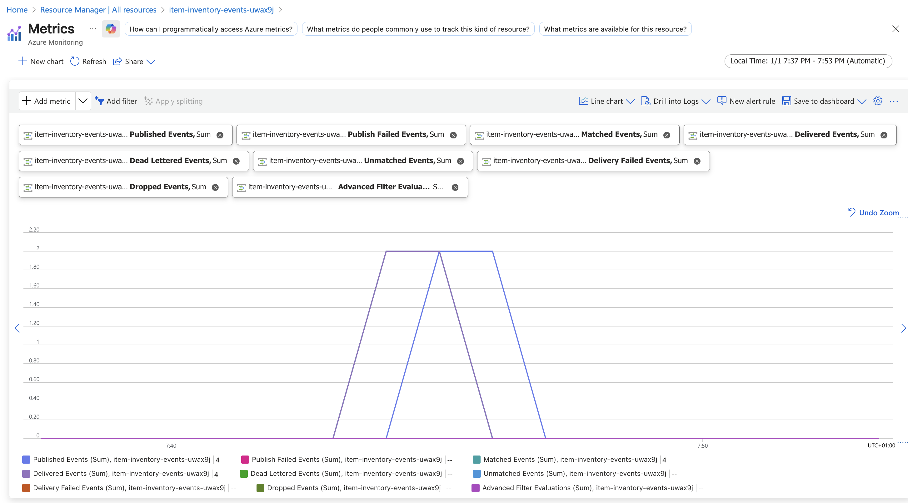
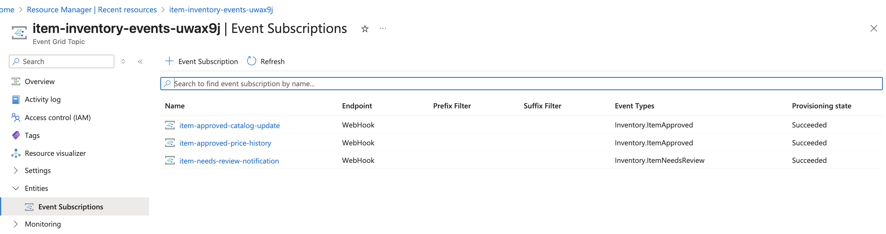
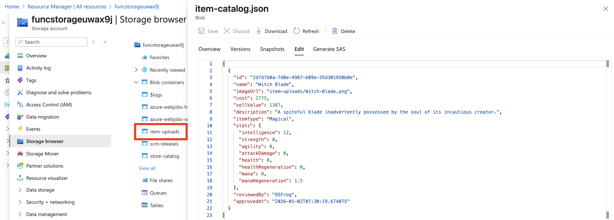
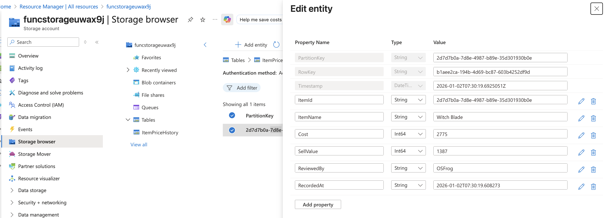

# Project Iteration 3: Event-Driven Data Processing 

### Syllabus objectives covered: 

- Implement function triggers by using data operations
- Implement input and output bindings (advanced scenarios)
- Chain functions using output bindings and triggers

### Learning goals:

Build sophisticated event-driven systems that respond to data changes across Azure services and process information automatically.

### Project description:

Create an automated data processing pipeline where functions respond to new data arriving in various Azure services.
Build functions that trigger when blobs are uploaded, when database records change, and when messages arrive in queues.

I have chosen to build an event-driven inventory management system where image uploads automatically trigger document creation, change detection publishes events,
and multiple subscribers react in parallel—demonstrating real-world pub/sub messaging and fan-out patterns.

### Implementation Steps:

1. Create Blob trigger function for image upload processing
2. Implement Cosmos DB trigger for Change Feed monitoring
3. Configure Event Grid topic and CloudEvents publishing
4. Add Event Grid trigger functions for event consumption
5. Implement fan-out pattern with multiple subscribers

## Conceptual overview

### Event-Driven Architecture: 

**Traditional architecture:** uses synchronous, direct calls between services. Service A directly calls Service B, 
which calls service C. This creates tight coupling where services must know about each other, failures will cascade, 
and scaling requires coordination.

**Event-driven architecture:** in some ways invents this. The services publish events when something happens, and 
interested services react independently. Services does not know about each other, they only know about events. This creates
loose coupling, independent scaling and failure isolation / delegation.

### Key principles:
- **Asynchronous communication** - Publishers don't wait for subscribers
- **Loose coupling** - Services communicate via events, not direct calls
- **Independent scaling** - Each service scales based on its own load
- **Failure isolation** - One service's failure does not cascade or crash others
- **Extensibility** - Add new subscribers without modifying publishers 

**In this project**
```
ProcessItemUpload doesn't call OnItemDocumentChange directly
                    ↓ 
ProcessItemUpload creates document in Cosmos DB
                    ↓
Cosmos Change Feed publishes event
                    ↓
OnItemDocumentChange reacts to event
                    ↓
OnItemDocumentChange doesn't call UpdateStoreCatalog directly
                    ↓
OnItemDocumentChange publishes to Event Grid
                    ↓
UpdateStoreCatalog + RecordPriceHistory react independently
```
This way no function knows about each other, they only know about events.

### Pub / Sub pattern
Publisher-Subscriber (Pub/Sub) is the core pattern enabling event-driven architecture.

**How it works:**
1. **Publisher** creates event and sends it to a central topic/broker
2. **Topic/broker** receives events and routes it to subscribers
3. **Subscribers** receive and process events independently 

**Example in this project:**
When `ItemApproved` event is published:
* **Decoupling:** OnItemDocumentChange doesn't know about catalog or price history
* **Scalability:** UpdateStoreCatalog and RecordPriceHistory run in parallel
* **Resilience:** If catalog update fails, price history still succeeds
* **Flexibility:** Adding a third subscriber (for example search indexing) requires zero changes to existing code


### Service Bus vs Event Grid:

**Service Bus purpose**: Reliable messaging for commands and items to work on. 

**Service Bus Used for**: Background jobs (process this order), Work queues ("resize these 100 images"), Pont-to-point communication, when **guarantied processing** is needed.

**Architecture**:


**Event Grid purpose:** Broadcast **events** and **notifications**

**Event Grid Used for:** "Something happened" notification, system-wide events ( blob created, VM started), Multiple reactions to same event, when you need **broadcasting**.

**Architecture:**

**Common pattern**
- Event grid: "new order created" (broadcast notification)
- Service bus: "process order 123" ( work the item with retry )

---

## Architecture 
Project architecture when fully implemented:

### High level flow

**What you are building:** An event-driven inventory system with 5 Azure Functions across 4 phases:
1. **Image Processing** - Blob trigger validates and creates Cosmos document
2. **Change Detection** - Cosmos trigger publishes events based on document status
3. **Event Routing** - Event Grid routes events by type
4. **Parallel Processing** - Multiple subscribers react independently to events

### Detailed System Architecture


❗We are not sending email in this example, but you get the gist of it.❗

**Components:**
- **5 Azure Functions:** ProcessItemUpload, OnItemDocumentChange, SendAdminNotification, UpdateStoreCatalog, RecordPriceHistory
- **3 Event Grid subscriptions:** ItemNeedsReview (1 subscriber), ItemApproved (2 subscribers)
- **4 storage types:** Cosmos DB, Blob Storage, Table Storage, Event Grid

---

## 1. Create Blob Trigger Function for Image Processing 

### Building overview
Process uploaded images, validate dimensions, create Cosmos DB stub documents.

### Infrastructure 
Required infrastructure can be found in `storage.tf` and `cosmosdb.tf`. Specifically we just need a blob container
and an item and leases container.

```hcl
# Blob container for .png images
resource "azurerm_storage_container" "item_uploads" {
  name                  = "item-uploads"
  storage_account_id    = azurerm_storage_account.functions-storage.id
}

# Cosmos DB sql container for item documents 
resource "azurerm_cosmosdb_sql_container" "items_container" {
  name                = "items"
  database_name       = azurerm_cosmosdb_sql_database.inventory_db.name
}
```

### Implementation
As for triggers, we can use a blob trigger to react to the uploaded images: 

```python
@app.function_name(name="ProcessItemUpload")
@app.blob_trigger(
    arg_name="item_upload",
    path="item-uploads/{itemName}",
    connection="AzureWebJobsStorage"
)
@app.cosmos_db_output(
    arg_name="item_document",
    database_name="inventorydb",            # References the Cosmos DB name
    container_name="items",                 # References the Cosmos DB sql container name
    connection="CosmosDbConnectionString"   # Reference in Application settings with connection string
)
def process_item_upload(
    item_upload: func.InputStream,
    item_document: func.Out[str],
):
```
Once an image is uploaded, the input binding trigger will start our Python function. In turn, it will create a new "item document"
with various data and metadata in a JSON format (see implementation in `function_app.py` for details).
The documents are then uploaded to our provisioned Cosmos DB.

**Document JSON example:**
```
{
    "id": "2d7d7b0a-7d8e-4987-b89e-35d301930b0e",
    "name": "Witch Blade",
    "imageUrl": "item-uploads/Witch-Blade.png",
    "metadata": {
        "imageHeight": 64,
        "imageWidth": 88,
        "imageFormat": "PNG",
        "filesizeKB": 11.67
    },
    // Admin fills these in step 2
    "cost": null,
    "sellValue": null,
    "description": null,
    "itemType": null,
    "stats": {...}, // All null initialy
    // Workflow controll
    "status": "pending_admin_review",
    "createdAt": "2026-01-01T17:44:53.94833",
    "updatedAd": null,
    "reviewedBy": null,
```

### Key Concepts
**Blob Trigger Mechanics:**
- **Polling interval:** Checks for new blobs every ~10 seconds (not instant)
- **Binding expression:** `{itemName}` extracts filename from path automatically
- **InputStream type:** Provides file content as stream, memory-efficient for large files

**Document Structure (Stub Pattern):**
- **Populated fields:** id, name, imageUrl, metadata (from image)
- **Null fields:** cost, stats, description (filled by admin later)
- **Status:** `pending_admin_review` (triggers admin notification in next step)

### How to Test
1. In order to test this function, simply provision infrastructure with the `up.sh` script. This script will also deploy 
our Azure Functions that are responsible for our business logic and flow.
2. Once provisioning is done, running the `test_upload.sh` script will upload 5 .png images to the `item-uploads` Blob container
and thus trigger the flow. `./scripts/test_upload.sh`
3. Verify that the items are uploaded to Blob storage, you should now be able to see five uploaded PNG images in Azure Portal.

4. Check function logs for our azure function `ProcessItemUpload`. You should be able to see the logs within the logs tab:
```
2026-01-01T17:44:54   [Information]   Executing 'Functions.ProcessItemUpload' (Reason='New blob detected(LogsAndContainerScan): item-uploads/Witch-Blade.png', Id=b7a6ce8d-a826-4f10-b9a4-b28de503ca9a)
2026-01-01T17:44:54   [Information]   Trigger Details: MessageId: 1c5d64dd-2d82-4d73-ada6-1aceff8ff4a2, DequeueCount: 1, InsertedOn: 2026-01-01T17:44:53.000+00:00, BlobCreated: 2026-01-01T17:44:46.000+00:00, BlobLastModified: 2026-01-01T17:44:46.000+00:00
2026-01-01T17:44:54   [Verbose]   Sending invocation id: 'b7a6ce8d-a826-4f10-b9a4-b28de503ca9a
2026-01-01T17:44:54   [Verbose]   Posting invocation id:b7a6ce8d-a826-4f10-b9a4-b28de503ca9a on workerId:579d87bf-600e-4ad1-9fea-fcf3ea02a31c
2026-01-01T17:44:54   [Information]   Received upload: <azure.functions.blob.InputStream object at 0x7f48182dfa00>
2026-01-01T17:44:54   [Information]   Processing upload: item-uploads/Witch-Blade.png
2026-01-01T17:44:54   [Information]   Item stub created: Witch Blade (ID: 2d7d7b0a-7d8e-4987-b89e-35d301930b0e)
2026-01-01T17:44:54   [Information]   Status: pending_admin_review
2026-01-01T17:44:54   [Information]   Image: item-uploads/Witch-Blade.png
2026-01-01T17:44:54   [Information]   Executed 'Functions.ProcessItemUpload' (Succeeded, Id=b7a6ce8d-a826-4f10-b9a4-b28de503ca9a, Duration=28ms)
```
5. Take a peek in the Cosmos DB resource as well, you will see that five documents are uploaded there.

As you can see, most of the item information is missing, which is expected, as these documents will be changed 
at a later implementation stage.

### Use Cases

This pattern (Blob trigger &rarr; Validation &rarr; Database) is useful for:
- **Content moderation systems** - Upload &rarr; scan for inappropriate content &rarr; queue for review
- **Document processing pipelines** - PDF upload &rarr; extract text &rarr; index for search
- **Media workflows** - Video upload &rarr; generate thumbnails &rarr; create metadata entry
- **Data ingestion** - CSV upload &rarr; parse &rarr; validate &rarr; store in database

**When NOT to use:**
- Real-time processing requirements (use Event Grid trigger for blobs instead)
- Small files that fit in memory (HTTP trigger might be simpler)

---

## 2 + 3: Implement Cosmos DB Trigger, Event Grid & Event publishing

### Building overview 
Function that reacts to document changes in real-time and publish events based on item document status.

### Infrastructure
This is where things start getting interesting! We will provision an Event Grid, which will be the backbone of our 
pub/sub and event driven architecture. Later we will create subscribers for our events, but for now we just need the Event Grid resource.
See `./terraform/eventgrid.tf` for full implementation.
```hcl
resource "azurerm_eventgrid_topic" "item_inventory_events" {
  name                = "${var.event_grid_prefix}${random_string.postfix.result}"
  location            = azurerm_resource_group.functions-group.location
  resource_group_name = azurerm_resource_group.functions-group.name
  input_schema        = "CloudEventSchemaV1_0" # This is the modern standard for Events.
}
```

The EventGrid resource provides us with an Endpoint url (on which to push events) and an Access Key for authentication.  
Both of these are configured in the `app_settings` of our Azure Linux Function App resource:
```hcl
# Event Grid Configuration
"EventGridTopicEndpoint" = azurerm_eventgrid_topic.item_inventory_events.endpoint
"EventGridTopicKey"      = azurerm_eventgrid_topic.item_inventory_events.primary_access_key
```

### Implementation
Now we just need to set up a Python function that triggers on Cosmos DB changes &rarr; creates events based on status.
This Azure Function will be our **Publisher**, and will create events for our to-be subscribers.  
The function will create one of two possible events defined in our code: `Inventory.ItemNeedsReview` or `Inventory.ItemApproved`.
```python
@app.function_name(name="OnItemDocumentChange")
@app.cosmos_db_trigger(
    arg_name="documents",
    database_name="inventorydb",            # References Cosmos DB Database
    container_name="items",                 # References Cosmos DB Container, which is essentially the same as a table
    connection="CosmosDbConnectionString",  # Connectivity type
    lease_container_name="leases",          # Progress tracking and fallback points for failing functions
)
@app.event_grid_output(
    arg_name="event_grid_event",
    topic_endpoint_uri="EventGridTopicEndpoint",    # Reference to Application settings variable
    topic_key_setting="EventGridTopicKey",          # Reference to Application setting variable

)
def on_item_document_change(
    documents: func.DocumentList,
    event_grid_event: func.Out[str]
):
    # Determine Event Type based on document status
    if item_document['status'] == "pending_admin_review":
        event_type = "Inventory.ItemNeedsReview"
        # Minimal data for item review notification
        event_data = {...}
    elif item_document['status'] == "approved":
        # Pass document trigger information to event and publish  
        event_data = {
            "itemName": item_document['name'],
            ...
        }

    # Create Event and publish to Event Grid: 
    event = {
        "specversion": "1.0",
        "id": str(uuid.uuid4()),
        "type": event_type,
        "source": "inventory-system/cosmos-db",
        "subject": f"items/{item_document['id']}",
        "time": datetime.utcnow().isoformat(),
        "data": event_data,
    }
   event_grid_event.set(json.dumps([event]))
```

### Key Concepts
**Cosmos DB Change Feed:**
- **How it works:** Cosmos DB maintains a sorted log of all document changes (creates, updates, deletes)
- **Near real-time:** Changes appear in feed within ~1 second
- **Ordered per partition:** Changes within same partition key are processed in order
- **Persistent:** Change feed retains history, allowing catch-up processing in the event of failures

**Change Feed vs Traditional Polling:**

| Aspect     | Change Feed                   | Traditional Polling                      |
|------------|-------------------------------|------------------------------------------|
| Latency    | <1 second                     | Depends on poll interval                 |
| Efficiency | Push-based, no wasted queries | Pull-based, queries even when no changes |
| Ordering   | Guaranteed per partition      | Not guaranteed                           |


**Leases container:**  

This is a container that is needed for the change feed trigger to track which items has been processed.
Its purpose is to track which changes has been processed and which function instance that is processing which partition.
It works as a checkpoint if a function crashes half-way through processing.

**Event Type routing:**

```python
if item_document['status'] == "pending_admin_review":
    event_type = "Inventory.ItemNeedsReview"  
```
`event_type` is the routing key for Event Grid subscriptions. Your subscription filters on this:
```hcl
included_event_types = ["Inventory.ItemNeedsReview"]  # <- Must match exactly!
```
Event Grid uses this string to decide which subscribers receive the event. Custom event types can be any string you choose,
just ensure publishers and subscribers agree on the naming convention.

In very simple terms: some piece of code or resource creates an event, pushes it onto the event grid. We then
define Event Grid subscriptions which listens for the particular event. The subscriber then routes / calls another
azure function through a webhook endpoint, which runs another piece of code.

### How to Test
1. Re-run the `up.sh` script for updated infrastructure and re-publishing of Azure Functions.
2. Run the `test_upload.sh` again to trigger our new Azure Function `OnItemDocumentChange`. For now, it will only create 
the `Inventory.ItemNeedsReview` event, but it can be clearly observed within the Event Grid resource in Azure Portal:

3. Logs from event publishing can be observed within the Logs tab for our new function: 
```
2026-01-01T18:44:32   [Information]   Executed 'Functions.OnItemDocumentChange' (Succeeded, Id=1cf46868-efc9-4fa0-9eb6-2b4b19c19459, Duration=10ms)
2026-01-01T18:44:42   [Information]   Executing 'Functions.OnItemDocumentChange' (Reason='New changes on container items at 2026-01-01T18:44:41.8946823Z', Id=5eba3b1e-5f50-4590-8568-df544c4f7373)
2026-01-01T18:44:42   [Verbose]   Sending invocation id: '5eba3b1e-5f50-4590-8568-df544c4f7373
2026-01-01T18:44:42   [Verbose]   Posting invocation id:5eba3b1e-5f50-4590-8568-df544c4f7373 on workerId:0083d274-bfc2-4d1b-86e0-9fc6f0c8cb35
2026-01-01T18:44:42   [Information]   Function triggered from change in Cosmos DB
2026-01-01T18:44:42   [Information]   Change detected: Glimmer Cape, status: pending_admin_review
2026-01-01T18:44:42   [Information]   Change detected: Scythe Of Vyse, status: pending_admin_review
2026-01-01T18:44:42   [Information]   Change detected: Witch Blade, status: pending_admin_review
2026-01-01T18:44:42   [Information]   Event published to Event Grid: Inventory.ItemNeedsReview
```

### Use Cases
- Real-time data synchronization
- Audit trail generation
- Triggering downstream processes

---

## 4 + 5: Event Grid Subscribers and Fan-Out Pattern with multilpe subscribers

### Building Overview
Create multiple Event Grid trigger functions that react independently to the same event.
This will demonstrate the fan-out pattern where one published event triggers parallel processing across multiple subscribers.
We will implement two subscriber resources and their corresponding subscriber functions for: 
- "Sending" a notification to a fictive Admin user for items that needs review.
- Creating / updating the Item Store Catalog.
- Tracking price histories for items as they are added to the Store Catalog.

### Infrastructure 
Since we have our Event Grid resource and Function Application provisioned, we first need to create Event Grid subscriptions 
that route events to azure function endpoints through webhooks. See `eventgrid-subscriptions.tf` for full implementation.

❗**Important note:** For subscriptions to be successfully created, the receiving functions **MUST** be running in Azure.
This is solved by doing a two-step provisioning of Azure resources, where Azure Functions are packaged and deployed before 
Event Grid subscriptions are created.❗

```hcl

# Subscription 1: ItemNeedsReview -> Admin Notification Function
resource "azurerm_eventgrid_event_subscription" "item_needs_review" {
  name                 = "item-needs-review-notification"
  scope                = azurerm_eventgrid_topic.item_inventory_events.id
  included_event_types = ["Inventory.ItemNeedsReview"]

  event_delivery_schema = "CloudEventSchemaV1_0" # Adhere to EventGrid event type
  # Route to Azure Function through webhook.
  # This is a direct URL -> to the running function within the Function Application.
  # Must also provide the System Key for authenticated connection!
  webhook_endpoint {
    url = "https://${azurerm_linux_function_app.functions-app.name}.azurewebsites.net/runtime/webhooks/EventGrid?functionName=SendAdminNotification&code=${data.azurerm_function_app_host_keys.functions_keys.event_grid_extension_config_key}"
  }
}


# Subscription 2: ItemApproved -> Store Catalog
resource "azurerm_eventgrid_event_subscription" "item_approved_store_catalog" {
  name                 = "item-approved-catalog-update"
  scope                = azurerm_eventgrid_topic.item_inventory_events.id
  included_event_types = ["Inventory.ItemApproved"]
  ...
}

# Subscription 3: ItemApproved -> Price History
resource "azurerm_eventgrid_event_subscription" "item_approved_price_history" {
  name                 = "item-approved-price-history"
  scope                = azurerm_eventgrid_topic.item_inventory_events.id
  included_event_types = ["Inventory.ItemApproved"]
  ...
}
```
Notice how each subscription resource can filter events on `included_event_types` property!

Secondly we must provision some new storage resources for our item Store Catalog, and for tracking price history.
We can chose Blob Container for our Store catalog as it is non-relational data in JSON format. For the price history, it is better
to use a SQL Table Storage, which is what we will do in this demonstration.
```hcl
# Blob Container - Approved item catalog, stored as JSON
resource "azurerm_storage_container" "store_catalog" {
  name               = "store-catalog"
  storage_account_id = azurerm_storage_account.functions-storage.id
}

# Table Storage - Table for tracking price history
resource "azurerm_storage_table" "price_history" {
  name                 = "ItemPriceHistory"
  storage_account_name = azurerm_storage_account.functions-storage.name
}
```

### Implementation
Implementation, is as in the previous steps trivial when using the Azure Function decorators. 

**Subscriber 1: SendAdminNotification**

This function is minimalistic, in a real world scenario this function could possibly be responsible for 
sending out emails with item documents that needs reviews to admins, or notify them about new tasks. For the sake of 
maintaining focus and scope, it just logs which information that admin needs to fill out.
```python
# Event Grid subscriber function
@app.function_name(name="SendAdminNotification")
@app.event_grid_trigger(arg_name="event")
def send_admin_notification(event: func.EventGridEvent):
    ...
    # Extract event data as specified in event producer function "OnItemDocumentChange"
    event_json = event.get_json()
    event_data = event_json.get('data', {})
    ...
```
Notice how data has the same structure as the published event from our previous implementation step.

**Subscriber 2: UpdateStoreCatalog**

This function is responsible for creating and updating the catalogue of approved items. It's subscribed to `Inventory.ItemApproved` events,
and will simply unpack the event data, and append it to a JSON file in our new Blob Container: `store-catalog`.
```python
# ApprovedItem Event Subscription function - Item Catalog
@app.function_name(name="UpdateStoreCatalog")
@app.event_grid_trigger(arg_name="approved_event")
@app.blob_input(
    arg_name="existing_catalog",
    path="store-catalog/item-catalog.json",
    connection="AzureWebJobsStorage"
)
@app.blob_output(
    arg_name="updated_catalog",
    path="store-catalog/item-catalog.json",  # All items written to single catalog file
    connection="AzureWebJobsStorage"
)
def update_store_catalog(
    approved_event: func.EventGridEvent,
    existing_catalog: func.InputStream,
    updated_catalog: func.Out[str]
):
    # Create catalog entry
    catalog_item = {...}
    
    # Read existing catalog (or create new if doesn't exist)
    if catalog_data:
        catalog_list = json.loads(catalog_data)
    else:
        catalog_list = []
        logging.info("Creating new catalog (no existing file)")

    # Write updated item catalog to Blob Container
    catalog_list.append(catalog_item)
    updated_catalog.set(json.dumps(catalog_list, indent=2))
```

**Subscriber 3: RecordPriceHistory**
This function is responsible for writing to our new Table Storage. It will create new price entries for items once the
`Inventory.itemApproved` event is fired.
```python
@app.function_name(name="RecordPriceHistory")
@app.event_grid_trigger(arg_name="approved_event")
@app.table_output(
    arg_name="price_history",
    table_name="ItemPriceHistory",  # References Table Storage
    connection="AzureWebJobsStorage"
)
def record_price_history(
    approved_event: func.EventGridEvent,
    price_history: func.Out[str],
):
    price_entry = {
        "PartitionKey": item_id,
        "RowKey": str(uuid.uuid4()),
        "ItemId": item_id,
        ...
    }

    # Write to Table Storage
    price_history.set(json.dumps(price_entry, indent=2))

```
### Key Concepts

**Fan-Out Pattern:**
One published event triggers multiple independent subscribers to execute in parallel.

**How it works in this project:**
```
OnItemDocumentChange publishes "Inventory.ItemApproved"
                ↓
        Event Grid Topic
                ↓
    ┌───────────┴───────────┐
    ↓                       ↓
UpdateStoreCatalog    RecordPriceHistory
(runs in parallel)    (runs in parallel)
```
**Benefits:**
- **Parallel processing:** Both subscribers execute simultaneously
- **Independent scaling:** Each subscriber scales based on its own workload
- **Failure isolation:** If catalog update fails, price history still succeeds
- **Extensibility:** Adding a third subscriber (e.g., search indexing) requires zero changes to publisher


**Event Grid Subscriptions:**
Subscriptions act as routing rules: "When event X happens, send to endpoint Y"

**Key configuration:**
- **Filter by type:** `included_event_types = ["Inventory.ItemApproved"]` => only matching events route to this subscriber
- **Webhook endpoint:** Direct URL to Azure Function with system key for authentication
- **Event schema:** CloudEventSchemaV1_0 ensures standard event format

**Why subscriptions decouple publisher from subscribers:**
- Publisher doesn't know who subscribes (or if anyone does)
- Adding/removing subscribers doesn't affect publisher code
- Each subscriber receives events independently


### How to Test
1. Same procedure as previous steps, run the `up.sh` script for provisioning of infrastructure and deploy functions.
You should see all three Event Subscriptions within the **Event Grid Topic** resource: 

2. Make sure Cosmos DB is populated with some Item Documents, this can be achieved, as previously with `test_upload.sh`.
3. The next step is to make our function `OnItemDocumentChange` function fire a `Inventory.itemApproved` event. We can do that by updating an item Document 
in the Cosmos DB, and set status to `approved`. I have provided a script `update_item_document.sh`. Run it once to query for all Document ID's, run it again with 
an ID in order to populate the missing fields in the Document, and set status to `approved`.
```
./update_item_documents.sh

4fa4875f-2ab8-4bc1-800d-1b74163b0747	Black King Bar	pending_admin_review
f9d2670d-d69c-4379-a46b-13ffede51ee5	Blink Dagger	pending_admin_review
60a11b47-7157-4d16-b55b-321c07ec0124	Glimmer Cape	pending_admin_review
53be9a50-3093-4119-b9f8-ed0f5a84308f	Scythe Of Vyse	pending_admin_review
2d7d7b0a-7d8e-4987-b89e-35d301930b0e	Witch Blade	    pending_admin_review
```
Now it can be run again with argument, for example: 
```bash
    ./update_item_documents.sh 2d7d7b0a-7d8e-4987-b89e-35d301930b0e
```
4. Visit the Azure Portal to see event metrics for each Event Subscription. We can also observe that new entries are 
created in our new Storage resources.  
**Item Catalog:**

**Price History:**



### Use Cases
**When to use fan-out with Event Grid:**
- **System notifications:** One event needs to trigger multiple independent actions (logging, metrics, notifications)
- **Workflow orchestration:** Trigger parallel approval processes or validation steps
- **Microservices coordination:** Decouple services while maintaining reactivity to shared events

**When NOT to use Event Grid:**
- Need guaranteed ordering (use Service Bus sessions instead)
- Need request-response pattern (use HTTP trigger instead)
- Need message-level transactions (use Service Bus instead)

❗**Important note:** Event Grid uses "at-least-once" delivery, meaning subscribers may receive the same event multiple times (due to retries). 
Functions must be idempotent and safe to execute multiple times with same input. ❗

---

## Trigger Selection Reference

### When to Use Each Trigger Type

| Scenario                      | Use This Trigger           | Why                                              |
|-------------------------------|----------------------------|--------------------------------------------------|
| Process files as uploaded     | **Event Grid** (for blobs) | Real-time (<1s), guaranteed delivery, no polling |
| Process files (simple)        | **Blob trigger**           | Easy setup, acceptable 10-30s delay              |
| React to database changes     | **Cosmos DB trigger**      | Change Feed provides ordered, reliable stream    |
| React to system events        | **Event Grid trigger**     | Fast, lightweight, built-in Azure service events |
| Guaranteed message processing | **Service Bus trigger**    | Dead letter queue, sessions, transactions        |
| Scheduled tasks               | **Timer trigger**          | CRON expressions, singleton execution            |
| User-initiated actions        | **HTTP trigger**           | Synchronous request-response                     |

### Blob Trigger vs Event Grid (for Blob Events)

| Aspect               | Blob Trigger                       | Event Grid Trigger                 |
|----------------------|------------------------------------|------------------------------------|
| **Latency**          | 10-30 seconds                      | <1 second                          |
| **Mechanism**        | Polling (scans container)          | Push (blob service emits event)    |
| **Reliability**      | Can miss rapid uploads             | Guaranteed delivery                |
| **Scale**            | Limited by polling frequency       | Handles high-frequency events      |
| **Cost**             | Included in function execution     | Per-event cost (minimal)           |
| **Setup complexity** | Simple (just trigger)              | Requires Event Grid subscription   |
| **Use when**         | Simple scenarios, acceptable delay | Production, high-volume, real-time |


## Error Handling Reference

### Event Grid Retry Behavior

**Default configuration:**
- **Max delivery attempts:** 30
- **Event TTL:**  1,440 minutes (24 hours)
- **Retry schedule:** Exponential backoff
- **Exponential backoff schedule:** (10s, 30s, 1m, 5m, 10m, 30m, 1h, 3h, 6h, 12h… up to TTL)

**Terraform configuration:**
```hcl
resource "azurerm_eventgrid_event_subscription" "example" {
  retry_policy {
    max_delivery_attempts = 30
    event_time_to_live    = 1440  # Minutes (24 hours)
  }
  
  # Optional: Dead letter destination
  dead_letter_destination {
    storage_blob {
      storage_account_id          = azurerm_storage_account.example.id
      storage_blob_container_name = "event-grid-deadletter"
    }
  }
}
```

**When retries occur:**
- HTTP 4xx (except 400, 413, 429) or 5xx from subscriber
- Subscriber timeout (60 seconds)
- Network errors

**Dead letter queue:** After exhausting retries, events move to dead letter storage for investigation.

### Cosmos DB Trigger Retry

**Behavior:**
- Uses lease-based checkpointing (no max retry limit)
- Retries from last successful checkpoint indefinitely
- Lease timeout: 60 seconds (then another instance can take over)

**Failure handling:**
- Function crashes → New instance resumes from checkpoint
- Poison documents → No built-in poison queue (handle in code)

### Blob Trigger Retry

**Default behavior:**
```json
// host.json
{
  "extensions": {
    "blobs": {
      "maxDequeueCount": 5
    }
  }
}
```

**After 5 failures:** Message moves to `{queue-name}-poison` queue.

## Key Learning Questions:

### How do different data operation triggers handle high-frequency events?
**Cosmos DB Change Feed:**  
Uses a checkpoint based system with lease containers to track processing progress across multiple function instances. When events 
arrive rapidly, Azure Functions automatically scales out by creating new instances, with each instance claiming leases on different 
partition ranges to process changes in parallel.  

**Blob Triggers:**  
Use a polling mechanism that scans container content periodically (10 seconds by default), which can cause missed 
events under high load. They are not recommended for high-frequency scenarios.

**Event Triggers:**  
Handles high-frequency events through built inn throttling and delivery retry policies, automatically batching events when 
possible and distributing them across scaled function instances.

**Service Bus Triggers:**  
Provides the most control through configurable prefetch count and max concurrent call settings. This allows for balancing 
throughput with processing reliability. You can also configure session-enabled queues and force sequential processing 
even under high load.

### What's the difference between Blob triggers and Event Grid triggers for blob events?

**Blob Triggers** works by polling. The Azure Function scans storage containers periodically looking for new or modified files.
This introduces some latency, which can result in missed triggers for rapid successive uploads. This polling mechanism 
is therefore not reliable for time-sensitive scenarios.  

**Event Grid Triggers for Blob events** are truly event driven. The **Storage Account** immediately emits events when blobs are 
created, modified or deleted. The **Event Grid** delivers these events to your functions within seconds, and with guarantied delivery.
Event Grid costs per event but provides near real-time processing across multiple storage account in different subscriptions and includes filtering 
options for routing specific blob events to your functions. Event Grid is the recommended approach if a workload requires reliable timely blob processing.

### How can you ensure exactly-once processing when functions are triggered by data changes?

**Idempotency** is the primary strategy. Design your functions so that processing the same event multiple times produce the same result.
One way is to check if the operation is already completed, for example by querying the Cosmos DB for existing document with the same event's ID.

**Cosmos DB** provides **optimistic concurrency** through ETags. When updating documents, include the `if-match` header with the document's ETag to ensure 
updates only succeeds if no one else modified it.

**Service Bus** offers duplicate detection through message IDs and session-enabled queues for guaranteed in-order processing within a session.
The combination of idempotent operations and explicit deduplication checks ensures reliable and exactly-once semantics 
even when Azure Functions "at-least-once" delivery guarantee causes retries.