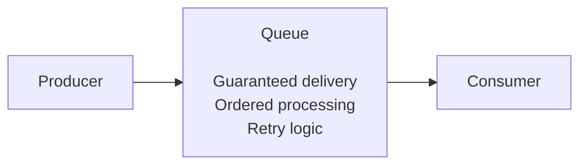
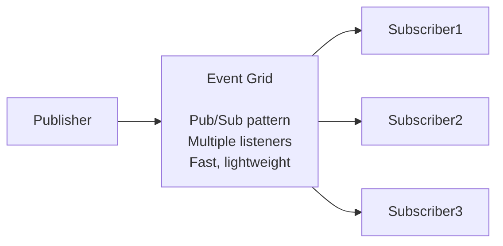
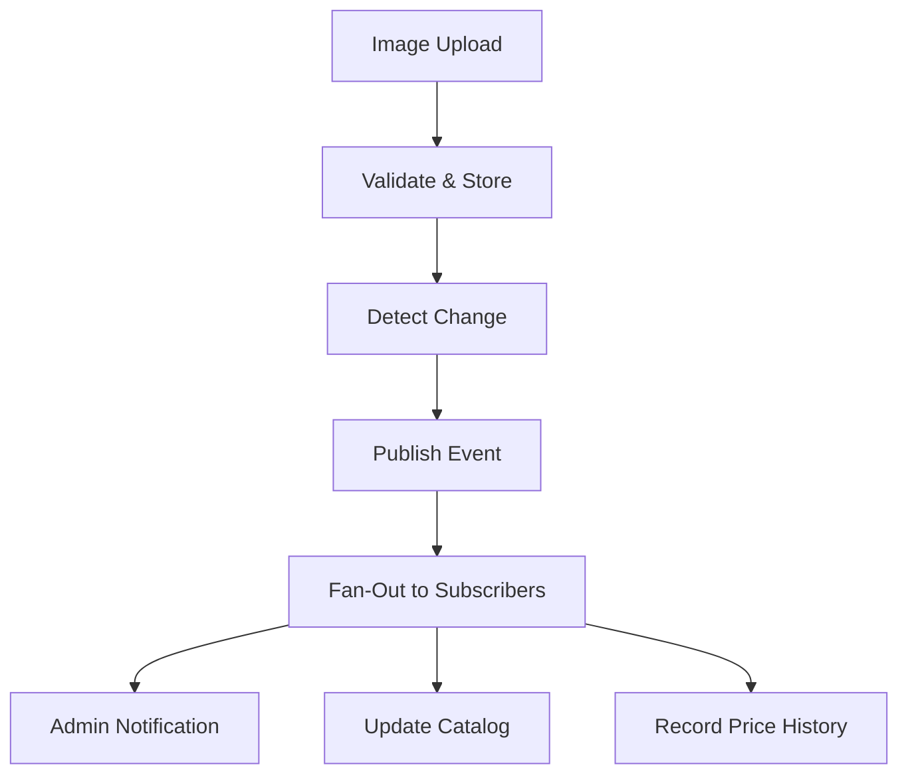

# Project Iteration 3: Event-Driven Data Processing 

### Syllabus objectives covered: 

- Implement function triggers by using data operations
- Implement input and output bindings (advanced scenarios)
- Chain functions using output bindings and triggers

### Learning goals:

Build sophisticated event-driven systems that respond to data changes across Azure services and process information automatically.

### Project description:

Create an automated data processing pipeline where functions respond to new data arriving in various Azure services.
Build functions that trigger when blobs are uploaded, when database records change, and when messages arrive in queues.

I have chosen to build a event-driven inventory management system where image uploads automatically trigger document creation, change detection publishes events,
and multiple subscribers react in parallel—demonstrating real-world pub/sub messaging and fan-out patterns.

### Implementation Steps:

1. Create Blob trigger function for image upload processing
2. Implement Cosmos DB trigger for Change Feed monitoring
3. Configure Event Grid topic and CloudEvents publishing
4. Add Event Grid trigger functions for event consumption
5. Implement fan-out pattern with multiple subscribers
6. Test end-to-end event flow with monitoring

## Conceptual overview

### Event-Driven Architecture: 

**Traditional architecture:** uses synchronous, direct calls between services. Service A directly calls Service B, 
which calls service C. This creates tight coupling where services must know about each other, failures will cascade, 
and scaling requires coordination.

**Event-driven architecture:** in some ways invents this. The services publish events when something happens, and 
interested services react independently. Services does not know about each other, they only know about events. This creates
loose coupling, independent scaling and failure isolation / delegation.

### Key principles:
- **Asynchronous communication** - Publishers don't wait for subscribers
- **Loose coupling** - Services communicate via events, not direct calls
- **Independent scaling** - Each service scales based on its own load
- **Failure isolation** - One service's failure does not cascade or crash others
- **Extensibility** - Add new subscribers without modifying publishers 

**In this project**
```
ProcessItemUpload doesn't call OnItemDocumentChange directly
                    ↓ 
ProcessItemUpload creates document in Cosmos DB
                    ↓
Cosmos Change Feed publishes event
                    ↓
OnItemDocumentChange reacts to event
                    ↓
OnItemDocumentChange doesn't call UpdateStoreCatalog directly
                    ↓
OnItemDocumentChange publishes to Event Grid
                    ↓
UpdateStoreCatalog + RecordPriceHistory react independently
```
This way no function knows about each other, they only know about events.

### Pub / Sub pattern
Publisher-Subscriber (Pub/Sub) is the core pattern enabling event-driven architecture.

**How it works:**
1. **Publisher** creates event and sends it to a central topic/broker
2. **Topic/broker** receives events and routes it to subscribers
3. **Subscribers** receive and process events independently 

**Example in this project:**
When `ItemApproved` event is published:
* **Decoupling:** OnItemDocumentChange doesn't know about catalog or price history
* **Scalability:** UpdateStoreCatalog and RecordPriceHistory run in parallel
* **Resilience:** If catalog update fails, price history still succeeds
* **Flexibility:** Adding a third subscriber (for example search indexing) requires zero changes to existing code


### Service Bus vs Event Grid:

**Service Bus purpose**: Reliable messaging for commands and items to work on. 

**Service Bus Used for**: Background jobs (process this order), Work queues ("resize these 100 images"), Pont-to-point communication, when **guarantied processing** is needed.

**Architecture**:


**Event Grid purpose:** Broadcast **events** and **notifications**

**Event Grid Used for:** "Something happened" notification, system-wide events ( blob created, VM started), Multiple reactions to same event, when you need **broadcasting**.

**Architecture:**

**Common pattern**
- Event grid: "new order created" (broadcast notification)
- Service bus: "process order 123" ( work the item with retry )

---

## Architecture 
Project architecture when fully implemented:

### High level flow

**What you are building:** An event-driven inventory system with 5 Azure Functions across 4 phases:
1. **Image Processing** - Blob trigger validates and creates Cosmos document
2. **Change Detection** - Cosmos trigger publishes events based on document status
3. **Event Routing** - Event Grid routes events by type
4. **Parallel Processing** - Multiple subscribers react independently to events

### Detailed System Architecture


❗We are not sending email in this example, but you get the gist of it.❗

**Components:**
- **5 Azure Functions:** ProcessItemUpload, OnItemDocumentChange, SendAdminNotification, UpdateStoreCatalog, RecordPriceHistory
- **3 Event Grid subscriptions:** ItemNeedsReview (1 subscriber), ItemApproved (2 subscribers)
- **4 storage types:** Cosmos DB, Blob Storage, Table Storage, Event Grid

---

## 1. Create Blob Trigger Function (Image Processing)

### Building overview
Process uploaded images, validate dimensions, create Cosmos DB stub documents.

### Infrastructure (Terraform)
Required infrastructure can be found in `storage.tf` and `cosmosdb.tf`. Specifically we just need a blob container
and an item and leases container.

```hcl
# Blob container for .png images
resource "azurerm_storage_container" "item_uploads" {
  name                  = "item-uploads"
  storage_account_id    = azurerm_storage_account.functions-storage.id
}

# Cosmos DB sql container for item documents 
resource "azurerm_cosmosdb_sql_container" "items_container" {
  name                = "items"
  database_name       = azurerm_cosmosdb_sql_database.inventory_db.name
}
```

### Implementation
As for triggers, we can use a blob trigger to react to the uploaded images: 

```python
@app.function_name(name="ProcessItemUpload")
@app.blob_trigger(
    arg_name="item_upload",
    path="item-uploads/{itemName}",
    connection="AzureWebJobsStorage"
)
@app.cosmos_db_output(
    arg_name="item_document",
    database_name="inventorydb",            # References the Cosmos DB name
    container_name="items",                 # References the Cosmos DB sql container name
    connection="CosmosDbConnectionString"   # Reference in Application settings with connection string
)
def process_item_upload(
    item_upload: func.InputStream,
    item_document: func.Out[str],
):
```
One a image is uploaded, the input binding trigger will start our python function. In turn, it will create a new "item document"
with various data and metadata in a JSON format (see implementation in `function_app.py` for details).
The documents are then uploaded to our provisioned Cosmos DB.

**Document JSON example:**
```
{
    "id": "2d7d7b0a-7d8e-4987-b89e-35d301930b0e",
    "name": "Witch Blade",
    "imageUrl": "item-uploads/Witch-Blade.png",
    "metadata": {
        "imageHeight": 64,
        "imageWidth": 88,
        "imageFormat": "PNG",
        "filesizeKB": 11.67
    },
    // Admin fills these in step 2
    "cost": null,
    "sellValue": null,
    "description": null,
    "itemType": null,
    "stats": {...}, // All null initialy
    // Workflow controll
    "status": "pending_admin_review",
    "createdAt": "2026-01-01T17:44:53.94833",
    "updatedAd": null,
    "reviewedBy": null,
```

### Key Concepts
**Blob Trigger Mechanics:**
- **Polling interval:** Checks for new blobs every ~10 seconds (not instant)
- **Binding expression:** `{itemName}` extracts filename from path automatically
- **InputStream type:** Provides file content as stream, memory-efficient for large files
- 
**Document Structure (Stub Pattern):**
- **Populated fields:** id, name, imageUrl, metadata (from image)
- **Null fields:** cost, stats, description (filled by admin later)
- **Status:** `pending_admin_review` (triggers admin notification in next step)

### How to Test
1. In order to test this function, simply provision infrastructure with the `up.sh` script. This script will also deploy 
our Azure Functions that are responsible for our business logic and flow.
2. Once provisioning is done, running the `test_upload.sh` script will upload 5 .png images to the `item-uploads` Blob container
and thus trigger the flow. `./scripts/test_upload.sh`
3. Verify that the items are uploaded to Blob storage, you should now be able to see five uploaded PNG images in Azure Portal.

4. Check function logs for our azure function `ProcessItemUpload`. You should be able to see the logs within the logs tab:
```
2026-01-01T17:44:54   [Information]   Executing 'Functions.ProcessItemUpload' (Reason='New blob detected(LogsAndContainerScan): item-uploads/Witch-Blade.png', Id=b7a6ce8d-a826-4f10-b9a4-b28de503ca9a)
2026-01-01T17:44:54   [Information]   Trigger Details: MessageId: 1c5d64dd-2d82-4d73-ada6-1aceff8ff4a2, DequeueCount: 1, InsertedOn: 2026-01-01T17:44:53.000+00:00, BlobCreated: 2026-01-01T17:44:46.000+00:00, BlobLastModified: 2026-01-01T17:44:46.000+00:00
2026-01-01T17:44:54   [Verbose]   Sending invocation id: 'b7a6ce8d-a826-4f10-b9a4-b28de503ca9a
2026-01-01T17:44:54   [Verbose]   Posting invocation id:b7a6ce8d-a826-4f10-b9a4-b28de503ca9a on workerId:579d87bf-600e-4ad1-9fea-fcf3ea02a31c
2026-01-01T17:44:54   [Information]   Received upload: <azure.functions.blob.InputStream object at 0x7f48182dfa00>
2026-01-01T17:44:54   [Information]   Processing upload: item-uploads/Witch-Blade.png
2026-01-01T17:44:54   [Information]   Item stub created: Witch Blade (ID: 2d7d7b0a-7d8e-4987-b89e-35d301930b0e)
2026-01-01T17:44:54   [Information]   Status: pending_admin_review
2026-01-01T17:44:54   [Information]   Image: item-uploads/Witch-Blade.png
2026-01-01T17:44:54   [Information]   Executed 'Functions.ProcessItemUpload' (Succeeded, Id=b7a6ce8d-a826-4f10-b9a4-b28de503ca9a, Duration=28ms)
```
5. Take a peek in the Cosmos DB resource as well, you will see that five documents are uploaded there.

As you can see, most of the item information is missing, which is expected, as these documents will be changed 
at a later implementation stage.

### Use Cases

This pattern (Blob trigger &rarr; Validation &rarr; Database) is useful for:
- **Content moderation systems** - Upload &rarr; scan for inappropriate content &rarr; queue for review
- **Document processing pipelines** - PDF upload &rarr; extract text &rarr; index for search
- **Media workflows** - Video upload &rarr; generate thumbnails &rarr; create metadata entry
- **Data ingestion** - CSV upload &rarr; parse &rarr; validate &rarr; store in database

**When NOT to use:**
- Real-time processing requirements (use Event Grid trigger for blobs instead)
- Small files that fit in memory (HTTP trigger might be simpler)


---


### How Events Types ties everything together for Event Grid Publisher / Subscribers:

```python
if item_document['status'] == "pending_admin_review":
    event_type = "Inventory.ItemNeedsReview"  
```
`event_type` is the routing key for Event Grid subscriptions. Your subscription filters on this:
```hcl
included_event_types = ["Inventory.ItemNeedsReview"]  # <- Must match exactly!
```
Event Grid uses this string to decide which subscribers receive the event. Custom event types can be any string you choose,
just ensure publishers and subscribers agree on the naming convention.

In very simple terms. Some pice of code or resource creates an event, pushes it onto the event grid. We then 
define Event Grid subscriptions which listens for the particular event. The subscriber then routes / calls another 
azure function through a webhook endpoint, which runs another piece of code. 

### Semi-BIS Terraform file structure: 
## File Structure Summary
```
terraform/
├── main.tf                       # Provider, resource group, random suffix
├── variables.tf                  # All input variables
├── storage.tf                    # Storage account, containers, tables
├── cosmosdb.tf                   # Cosmos DB, databases, containers
├── eventgrid.tf                  # Event Grid topic
├── eventgrid-subscriptions.tf    # Event Grid subscriptions (separate for clarity)
├── functions.tf                  # App Insights, Service Plan, Function App
└── outputs.tf                    # All outputs 
```

### storage.tf 
Holds storage infrastructure for
- Item image uploads .png (Blob Container)
- Store catalog .json (Blob Container)
- Price history (Table Storage)

### cosmosdb.tf
Used for holding documents created by function and followup by administrator

Everything will be automatic, the "user" just uploads an image and everything else happens

### Subscriptions: 
- ItemNeedsReview &rarr; Notification to admin.
- ItemApproved &rarr; Update Store Catalog with new item for sale.
- ItemApproved &rarr; Store Price History for item in table storage. 


## Event Grid Subscriptions:
An Event Grid implements the Pub/Sub architecture.
### Component breakdown: 
**1. Event Grid Topic (Message Bus):**  
A centralized endpoint that receives and routes events.  
Terraform configuration example: 
```hcl
# terraform/eventgrid.tf
resource "azurerm_eventgrid_topic" "inventory_events" {
  name                = "event-name"
  resource_group_name = azurerm_resource_group.functions-group.name
  location            = "northeurope"
  
  input_schema = "CloudEventSchemaV1_0"  # Accepts CloudEvents format
}
```
The EventGrid resource provides us with a Endpoint url (on which to push events) and an Access Key for authentication.  
Both of these are configured in the `app_settings` of our Azure Linux Function App resource:  
```hcl
# Event Grid Configuration
"EventGridTopicEndpoint" = azurerm_eventgrid_topic.item_inventory_events.endpoint
"EventGridTopicKey"      = azurerm_eventgrid_topic.item_inventory_events.primary_access_key
```

**2. Publisher (Event producer):**  
Azure Function that sends events TO the Event Grid Topic.  
Publisher Function example:
```python
import azure.functions as func
import json
app = func.FunctionApp()

@app.function_name(name="OnItemChanged")
@app.cosmos_db_trigger(...)
@app.event_grid_output(
    arg_name="event_grid_event",
    topic_endpoint_uri="EventGridTopicEndpoint",  #  Points to Topic URI
    topic_key_setting="EventGridTopicKey"         #  Access key for auth
)
def on_item_changed(documents, event_grid_event):
    # Create CloudEvent
    event = {
        "specversion": "1.0",
        "type": "Inventory.ItemNeedsReview",      # Event type (important for routing!)
        "source": "inventory-system/cosmos-db",
        "data": { ... }
    }
    
    # Publish to Event Grid Topic
    event_grid_event.set(json.dumps([event]))
```
**What happens:**

1. Function creates event of type Inventory.ItemNeedsReview
2. Azure Functions runtime sends HTTP POST to Event Grid Topic endpoint
3. Event Grid Topic receives and stores the event
4. Event Grid begins routing process

**3. Event Grid Subscription (Routing Rule):**
A configuration that tells Event Grid that, "when event X happens, route to endpoint Y".  
Terraform configuration example:
```hcl
# terraform/eventgrid-subscriptions.tf
resource "azurerm_eventgrid_event_subscription" "item_needs_review" {
  name  = "item-needs-review-notification"
  scope = azurerm_eventgrid_topic.inventory_events.id   #  Which Topic to monitor
  included_event_types = ["Inventory.ItemNeedsReview"]  # Only route these event types
  event_delivery_schema = "CloudEventSchemaV1_0"        # Adhere to EventGrid event type
  
  # Destination: Where to send matching events
  webhook_endpoint {
    url = "https://my-function-app.azurewebsites.net/runtime/webhooks/eventgrid?functionName=SendAdminNotification"
  }
}
```
This configures:
- **Source:** Event Grid Topic `inventory-events`
- **Filter:** Only events of type `Inventory.ItemNeedsReview`
- **Destination:** Webhook to notification through url webhook

**4. Subscriber (Event Consumer):**
A function that receives events FROM Event Grid via webhook.  
Subscriber function example: 
```python
import azure.functions as func
import logging

app = func.FunctionApp()


@app.function_name(name="SendAdminNotification")
@app.event_grid_trigger(arg_name="event")  # <- Event Grid trigger, no explicit config needed!
def send_admin_notification(event: func.EventGridEvent):
    # Process the event
    logging.info(f"Received event: {event.event_type}")
    data = event.get_json().get('data', {})
    # ... handle notification
```
In this project, we filter on two different events, but for three subscribers:
- ItemNeedsReview event &rarr; Only goes to SendAdminNotification 
- ItemApproved event &rarr; Goes to UpdateItemCatalog + ItemPriceHistory

## implementation plan: 

1) Blob trigger - Image processing
   1) Blob trigger (automatic file processing )
   2) Multiple output bindings  (blob + cosmos DB)
   3) Real image processing (resize)
   4) Metadata extraction
2) Cosmos DB change feed trigger - react to new patterns (on item created)
   1) Cosmos DB change feed (react to database change)
   2) Event grid output binding (publish event)
   3) Event-driven architecture
3) Event Grid Trigger - Send admin notification
   1) Event Grid trigger (react to system events)  
   2) Multiple subscribers to same event 
   3) Loose coupling 
4) Update item catalog, and price history on the same `ItemApproved` event.


Other stuff to do: 
- Error handling and Retry policies : Blob trigger  (poison blob after max number of retries `host.json`)
- Cosmos DB trigger (retries from last checkpoint) 
- Event grid: dead letter destination for failures, built-in retry with exponential backoff. ( configure in event grid subscription )  


### Interesting test scenarios:
1. Upload invalid file (not an image) &rarr;Trigger should fail, retry, then poison queue
2. Cosmos DB unavailable (simulate by wrong connection string) &rarr; Blob trigger retries, eventually fails
3. Event Grid endpoint down &rarr; Event Grid retries with backoff, then dead letters
4.Duplicate processing (idempotency test) &rarr;  Upload same file twice  + Ensure no duplicate items in Cosmos DB


### Extra infrastructure needed 
- event grid topic 
- event subscription 
- storage containers ( item uploads, item thumbnail, items, leases - for change feed)


### Leases container: 
This is a container that is needed for the change feed trigger to track which items has been processed.
Its purpose is to track which changes has been processed and which function instance that is processing which partition.

It works as a checkpoint if a function crashes half-way through processing.


### Common fail scenarios and outcome: 
``` 
Message has reached MaxDequeueCount of 5. Moving message to queue 'webjobs-blobtrigger-poison'.
```

### Running the function locally: 
1. Create the terraform outputs that we need for our bindings: 
   - Connection string to the Blob storage for image uploads 
   - Connection string to the storage account where the function will write documents
2. Capture them in a script, they are sensitive so we can not see them directly from the Terraform output.
3. Add them to your `local.settings.json` configuration so that your locally running function can interact with both databases.


### Test script 
I have added a script for testing uploads: `./test_upload.sh`. This script will use the Azure CLI and upload an image to the Azure Blob Storage, and thus trigger the 
azure function to create a new item document, and upload it to the Cosmos DB. 


I highly suggest that iteratively add configurations to your `local.settings.json`. It is an excellent way of 
debugging and figuring out how everything ties together from your local machine, while using real provisioned Azure Resources.


In order for eventgrid subscriptions to be able to connect, we need the azure functions to be deployed and running.   
This is so that the subscriptions are able to connect through the webhook. To solve this, we do deployment in three steps: 
1) Provision infrastructure 
2) Deploy Azure Functions
3) Create and connect Event Grid Subscriptions
Everything is automated, so the only steps necessary is to run the `up.sh` script.


When everything is provisioned, run the `.test_upload.sh` script to upload 5 .png images and trigger the first 
event grid event: `ItemNeedsReview`.
Once that is done, you can run the `update_item_documents.sh`. It takes 0 or 1 argument:  
0: Returns Document Id's from CosmosDB `inventorydb` container `items`.
1: Updates an item with some preset values, you can change these as you wish in the `update_item.py` script.

### Read more about the Cloud events here:
https://learn.microsoft.com/en-us/azure/event-grid/cloud-event-schema

## Key Learning Questions:

### How do different data operation triggers handle high-frequency events?
**Cosmos DB Change Feed:**  
Uses a checkpoint based system with lease containers to track processing progress across multiple function instances. When events 
arrive rapidly, Azure Functions automatically scales out by creating new instances, whith each instance claiming leasis on different 
partition ranges to process changes in parallel.  

**Blob Triggers:**  
Use a polling mechanism that scans container content periodically (10 seconds by default), which can cause missed 
events under high load. They are not recommended for high-frequency scenarios.

**Event Triggers:**  
Handles high-frequency events through built inn trottling and delivery retry policies, automatically batching events when 
possible and distributing them across scaled function instances.

**Service Bus Triggers:**  
Provides the most control through configurable prefetch count and max concurrent call settings. This allows for balancing 
throughput with processing reliability. You can also configure session-enabled queues and force sequential processing 
even under high load.

### What's the difference between Blob triggers and Event Grid triggers for blob events?

**Blob Triggers** works by polling. The Azure Function scans storage containers periodically looking for new or modified files.
This introduces some latency, which can result in missed triggers for rapid successive uploads. This polling mechanism 
is therefore not reliable for time-sensitive scenarios.  

**Event Grid Triggers for Blob events** are truly event driven. The **Storage Account** immediately emits events when blobs are 
created, modified or deleted. The **Event Grid** delivers these events to your functions within seconds, and with guarantied delivery.
Event Grid costs per event but provides near real-time processing across multiple storage account in different subscriptions and includes filtering 
options for routing specific blob events to your functions. Event Grid is the recommended approach if a workload requires reliable timely blob processing.

### How can you ensure exactly-once processing when functions are triggered by data changes?

**Idempotency** is the primary strategy. Design your functions so that processing the same event multiple times produce the same result.
One way is to check if the operation is already completed, for example by querying the Cosmos DB for existing document with the same event's ID.

**Cosmos DB** provides **optimistic concurrency** through ETags. When updating documents, include the `if-match` header with the document's ETag to ensure 
updates only succeeds if no one else modified it.

**Service Bus** offers duplicate detection through message IDs and session-enabled queues for guaranteed in-order processing within a session.
The combination of idempotent operations and explicit deduplication checks ensures reliable and exactly-once semantics 
even when Azure Functions "at-least-once" delivery guarantee causes retries.


## TODO: describe full flow with scripts running + screenshots from outputs 
## TODO: Add event-grid specific syllabus data that is relevant for the az204 exam. 

---

## 2. Implement Cosmos DB Trigger (Change Feed Monitoring)

### What You're Building
React to document changes in real-time, publish events based on status.

### Implementation
```python
[Cosmos trigger + Event Grid output binding]
```

**Key concepts:**
- Change Feed vs traditional polling
- Lease containers for checkpointing
- Event publishing patterns

### How to Test
```bash
python3 scripts/manage_items.py <item-id>  # Approve item
```

### Expected Output
[Log showing change detection and event publishing]

### Use Cases
- Real-time data synchronization
- Audit trail generation
- Triggering downstream processes

---

## 3. Configure Event Grid Topic and Publishing

### What You're Building
Central event topic that routes events to multiple subscribers based on type.

### Infrastructure (Terraform)
```hcl
[Event Grid topic configuration]
```

### Event Schema (CloudEvents)
```python
[Event structure with all required fields]
```

**CloudEvents Specification:**
| Field | Required | Purpose | Example |
|-------|----------|---------|---------|
| specversion | ✅ | Schema version | "1.0" |
| type | ✅ | Event type (routing key) | "Inventory.ItemApproved" |
| source | ✅ | Event producer | "inventory-system/cosmos-db" |
| id | ✅ | Unique event ID | uuid |
| subject | ❌ | Event subject | "items/abc-123" |
| time | ❌ | Event timestamp | ISO 8601 |
| data | ❌ | Event payload | {...} |

### How to Test
[Check Event Grid metrics in portal]

---

## 4. Add Event Grid Subscriber Functions

### What You're Building
Multiple functions that react independently to same events (fan-out pattern).

### 4a. Admin Notification Subscriber

**Implementation:**
```python
[SendAdminNotification function]
```

**Subscription configuration:**
```hcl
[Event Grid subscription filtering on ItemNeedsReview]
```

### 4b. Store Catalog Subscriber

**Implementation:**
```python
[UpdateStoreCatalog function with read-modify-write]
```

**Key concept: Idempotency**
```python
[Check if exists, update vs insert logic]
```

### 4c. Price History Subscriber

**Implementation:**
```python
[RecordPriceHistory with Table Storage]
```

**Table Storage keys:**
- PartitionKey: Item ID (groups history per item)
- RowKey: Timestamp (sortable, unique)

### How to Test Complete Flow
```bash
./scripts/test-complete-flow.sh
```

### Expected Output
[Logs showing all 3 functions executing in parallel]
[Screenshot of catalog blob, table entries]

---

## 5. Implement Fan-Out Pattern

### What You're Building
One event triggers multiple independent processors in parallel.

### Architecture
[Diagram showing event → 3 subscribers]

**Benefits:**
- Parallel processing
- Independent scaling
- Failure isolation

### Real-World Example
When `ItemApproved` publishes:
- UpdateStoreCatalog: ~100ms
- RecordPriceHistory: ~50ms
- SendNotification: ~200ms

**Sequential would take:** 350ms  
**Parallel takes:** 200ms (longest)

---

## 6. Configure Error Handling and Retry Policies

### Event Grid Retry Configuration

**Terraform:**
```hcl
[Retry policy configuration]
```

**Behavior:**
- Exponential backoff: 30s → 1m → 10m → 30m
- Max attempts: 30
- TTL: 24 hours
- Dead letter after exhaustion

### Testing Failure Scenarios

**Test 1: Transient failure**
[Simulate network issue, watch retry]

**Test 2: Permanent failure**
[Invalid event, check dead letter queue]

### Idempotency Patterns
[Code showing deduplication logic]

---

## 7. Test End-to-End Event Flow

### Complete Test Script
```bash
[Step-by-step testing commands]
```

### Monitoring
[Application Insights queries]
[Expected log sequence]

---

## Advanced Topics

### Webhook Authentication
[System keys vs Private Endpoints]

### Change Feed Checkpointing
[Leases container deep dive]

### CloudEvents vs Event Grid Schema
[Comparison table]

---

## Comparison Tables

### Trigger Comparison
[Table from your current content]

### Event Grid vs Service Bus
[When to use what - decision matrix]

---

## Key Learning Questions
[Your current excellent questions]

---

## Additional Resources
[Links to docs]gg